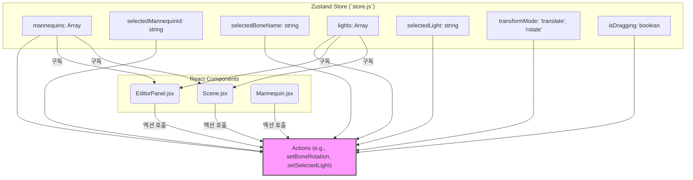
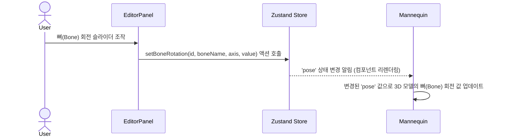
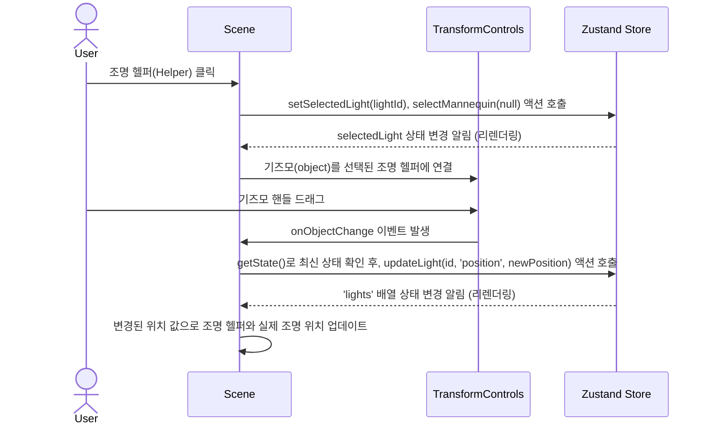

# LumoStage 아키텍처: 상태 및 이벤트 흐름

이 문서는 LumoStage 애플리케이션의 핵심 아키텍처, 특히 **Zustand를 사용한 상태 관리**와 **사용자 상호작용에 따른 이벤트 흐름**을 설명합니다.

---

## 1. 중앙 상태 관리: Zustand (`store.js`)

애플리케이션의 모든 핵심 데이터는 `store.js` 파일에 정의된 단일 Zustand 스토어에서 관리됩니다. 컴포넌트들은 이 스토어를 "구독"하고, 스토어의 데이터가 변경되면 자동으로 리렌더링됩니다.

- **상태 (State)**: 마네킹, 조명, 현재 선택된 객체, UI 모드 등 모든 정보가 객체 형태로 저장됩니다.
- **액션 (Actions)**: 상태를 변경할 수 있는 유일한 방법입니다. 예를 들어 `setBoneRotation` 액션은 특정 마네킹의 특정 뼈 회전 값을 업데이트합니다.
- **구독 (Subscription)**: `EditorPanel.jsx`은 마네킹과 조명 목록을 구독하여 UI를 그리고, `Scene.jsx`는 동일한 데이터를 구독하여 3D 객체를 렌더링합니다.

---

## 2. 사용자 이벤트 흐름 (Event Propagation)

사용자가 3D 씬이나 UI와 상호작용할 때 이벤트가 발생하고, 이는 상태 변경으로 이어집니다. 대표적인 두 가지 시나리오입니다.

### 시나리오 1: 사용자가 UI 슬라이더로 뼈를 회전시킬 때

1.  사용자가 `EditorPanel.jsx`에 있는 슬라이더를 움직입니다.
2.  `EditorPanel.jsx`는 `onChange` 이벤트를 받아, `setBoneRotation` 액션을 호출하여 중앙 스토어의 `mannequins` 상태를 업데이트합니다.
3.  `Mannequin.jsx` 컴포넌트는 `pose` 상태가 변경된 것을 감지하고 리렌더링됩니다.
4.  `Mannequin.jsx`는 새로운 `pose` 값을 실제 3D 모델의 뼈에 적용하여 화면을 갱신합니다.

### 시나리오 2: 사용자가 기즈모(Gizmo)로 조명을 움직일 때

1.  사용자가 `Scene.jsx`에 렌더링된 조명 헬퍼(예: 구)를 클릭합니다.
2.  `onClick` 이벤트가 발생하여 `setSelectedLight` 액션을 호출, 중앙 스토어에 어떤 조명이 선택되었는지 기록합니다.
3.  `Scene.jsx`는 `selectedLight`가 변경된 것을 감지하고, `TransformControls`(기즈모)를 해당 조명 헬퍼에 붙여서 화면에 표시합니다.
4.  사용자가 기즈모를 움직이면 `onObjectChange` 이벤트가 발생합니다.
5.  이벤트 핸들러는 스토어에서 **현재 시점의 최신 상태**를 가져와(`getState`) 지금 조명이 선택된 것이 맞는지 다시 확인하고, `updateLight` 액션을 호출하여 조명의 위치 값을 업데이트합니다.
6.  `Scene.jsx`는 `lights` 상태 배열이 변경된 것을 감지하고, 조명과 헬퍼의 위치를 화면에 새로 갱신합니다.
