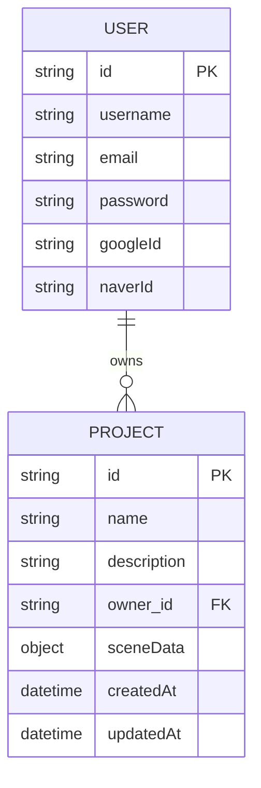

# LumoStage 프로젝트 데이터베이스 및 대시보드 설계

## 1. 개요

이 문서는 LumoStage 에디터의 작업 내용을 데이터베이스에 저장하고, 사용자가 자신의 프로젝트들을 관리할 수 있는 대시보드 기능을 구현하기 위한 전체적인 기술 설계를 정의합니다.

- **주요 기능:**
  - 사용자 계정 관리 (회원가입, 로컬 및 소셜 로그인)
  - 프로젝트 생성, 조회, 수정, 삭제 (CRUD)
  - 프로젝트 대시보드
  - 에디터와 데이터베이스 연동 (불러오기, 저장하기)

## 2. 데이터 모델링 (UML)

사용자(User)와 프로젝트(Project) 간의 관계는 1:N 입니다. 한 명의 사용자는 여러 개의 프로젝트를 가질 수 있습니다. 프로젝트는 `owner_id` 필드를 통해 해당 사용자를 참조합니다.



- `PROJECT.sceneData`는 조명, 카메라, 마네킹 위치/회전 등 에디터의 모든 상태를 포함하는 유연한 JSON 객체입니다.

## 3. 데이터베이스 스키마 (MongoDB / Mongoose)

`server/models/` 디렉토리 내에 생성될 Mongoose 스키마입니다.

### `User.js`

`User` 모델에서 `projects` 배열 필드를 제거하여 단방향 참조를 구현합니다. 특정 사용자의 프로젝트를 조회할 때는 `Project` 모델에서 `owner` 필드를 사용하여 쿼리합니다.

```javascript
const mongoose = require("mongoose");
const Schema = mongoose.Schema;

const UserSchema = new Schema(
  {
    username: { type: String, required: true, trim: true },
    email: { type: String, required: true, unique: true, trim: true },
    password: { type: String, required: false },
    googleId: { type: String, unique: true, sparse: true },
    naverId: { type: String, unique: true, sparse: true },
    // projects 필드 제거: User 모델은 Project를 직접 참조하지 않습니다.
  },
  { timestamps: true }
);

module.exports = mongoose.model("User", UserSchema);
```

### `Project.js`

```javascript
const mongoose = require("mongoose");
const Schema = mongoose.Schema;

const ProjectSchema = new Schema(
  {
    name: { type: String, required: true, trim: true },
    description: { type: String, trim: true },
    owner: { type: Schema.Types.ObjectId, ref: "User", required: true },
    sceneData: { type: Object, required: true, default: {} },
    thumbnail: { type: String, default: "" },
  },
  { timestamps: true }
);

module.exports = mongoose.model("Project", ProjectSchema);
```

## 4. 서버 아키텍처 (MVCS 패턴)

서버는 **MVCS (Model-View-Controller-Service)** 패턴을 따릅니다. 이를 통해 코드의 관심사를 분리하고 유지보수성을 높입니다.

- **Model:** 데이터베이스 스키마를 정의합니다. (Mongoose 스키마)
- **View:** API 서버에서는 JSON 형태의 응답이 View 역할을 대신합니다.
- **Controller:** HTTP 요청을 받고, 요청에 대한 유효성 검사를 수행한 후, Service 계층에 비즈니스 로직 처리를 위임합니다. 처리 결과를 받아 클라이언트에게 응답(JSON)을 보냅니다.
- **Service:** 실제 비즈니스 로직을 수행합니다. Controller로부터 전달받은 데이터를 처리하고, 필요한 경우 Model을 통해 데이터베이스와 상호작용합니다. 특정 사용자의 프로젝트를 조회할 때는 `Project` 모델의 `owner` 필드를 사용하여 쿼리합니다.

### 서버 디렉토리 구조

```
server/
├── controllers/         # 컨트롤러 레이어
│   ├── auth.controller.js
│   └── project.controller.js
├── services/            # 서비스 레이어
│   ├── auth.service.js
│   └── project.service.js
├── models/              # 모델 레이어
│   ├── User.js
│   └── Project.js
├── routes/              # 라우팅
│   ├── index.js
│   ├── auth.routes.js
│   └── project.routes.js
├── config/              # 설정 파일
│   └── passport.js
├── tests/               # 테스트 코드
│   ├── auth.test.js
│   └── project.test.js
├── server.js            # 서버 진입점
└── ...
```

## 5. 테스트 전략 (TDD)

개발은 **TDD (Test-Driven Development)** 방식을 따릅니다. 실제 구현 코드보다 테스트 코드를 먼저 작성하여 요구사항을 명확히 하고, 코드의 안정성을 확보합니다.

- **테스트 프레임워크:** `Jest`
- **API 엔드포인트 테스트:** `Supertest`

### TDD 개발 흐름

1.  **(RED)** 실패하는 테스트 케이스를 작성합니다. (기능 요구사항 정의)
2.  **(GREEN)** 테스트를 통과하는 최소한의 코드를 작성합니다.
3.  **(REFACTOR)** 작성된 코드를 리팩토링하여 코드 품질을 개선합니다.
4.  모든 기능에 대해 위 과정을 반복합니다.

## 6. API 엔드포인트 설계

`docs/PROJECT_DASHBOARD_API.md` 문서에서 제공된 상세 명세를 반영하여 API 설계를 구체화합니다.

### 인증 API (`/api/auth`)

| Method | Path               | 설명                       | 인증 필요 |
| ------ | ------------------ | -------------------------- | --------- |
| `POST` | `/register`        | 신규 사용자 등록           | No        |
| `POST` | `/login`           | 사용자 로그인 (JWT 발급)   | No        |
| `POST` | `/logout`          | 사용자 로그아웃            | Yes       |
| `GET`  | `/google`          | Google 로그인 시작         | No        |
| `GET`  | `/google/callback` | Google 로그인 후 콜백 처리 | No        |
| `GET`  | `/naver`           | Naver 로그인 시작          | No        |
| `GET`  | `/naver/callback`  | Naver 로그인 후 콜백 처리  | No        |

<details>
<summary><b>API 상세 응답 예시 (인증)</b></summary>

- **`POST /api/auth/register` (201)**
  ```json
  {
    "message": "회원가입이 완료되었습니다.",
    "user": { "id": "...", "username": "...", "email": "..." }
  }
  ```
- **`POST /api/auth/login` (200)**
  ```json
  {
    "message": "로그인에 성공했습니다.",
    "user": { "id": "...", "username": "...", "email": "..." }
  }
  ```
- **`GET /api/auth/google/callback` (JSON Mode)**
  ```json
  {
    "message": "소셜 로그인에 성공했습니다.",
    "provider": "google",
    "user": { "id": "...", "username": "...", "email": "..." }
  }
  ```

</details>

### 프로젝트 API (`/api/projects`)

| Method   | Path   | 설명                                 | 인증 필요         |
| -------- | ------ | ------------------------------------ | ----------------- |
| `GET`    | `/`    | 로그인된 사용자의 모든 프로젝트 조회 | Yes               |
| `POST`   | `/`    | 새 프로젝트 생성                     | Yes               |
| `GET`    | `/:id` | 특정 프로젝트 데이터 조회            | Yes (소유권 확인) |
| `PATCH`  | `/:id` | 특정 프로젝트 데이터 업데이트(저장)  | Yes (소유권 확인) |
| `DELETE` | `/:id` | 특정 프로젝트 삭제                   | Yes (소유권 확인) |

<details>
<summary><b>API 상세 응답 예시 (프로젝트)</b></summary>

- **`POST /api/projects` (201)**
  ```json
  {
    "message": "프로젝트가 생성되었습니다.",
    "project": { "id": "...", "name": "...", "owner": "..." }
  }
  ```
- **`GET /api/projects` (200)**
  ```json
  {
    "projects": [{ "id": "...", "name": "...", "owner": "..." }]
  }
  ```
- **`GET /api/projects/:id` (200)**
  ```json
  {
    "project": { "id": "...", "name": "...", "owner": "..." }
  }
  ```
- **`PATCH /api/projects/:id` (200)**
  ```json
  {
    "message": "프로젝트가 업데이트되었습니다.",
    "project": { "id": "...", "name": "...", "owner": "..." }
  }
  ```
- **`DELETE /api/projects/:id` (204)**
  - No Content

</details>

## 7. 프론트엔드 아키텍처 변경

### 라우팅 (`react-router-dom`)

- **Public Routes:**
  - `/`: `HomePage` (기존 히어로 페이지)
  - `/login`: `LoginPage`
  - `/register`: `RegisterPage`
- **Private Routes (로그인 필요):**
  - `/projects`: `ProjectsDashboardPage` (프로젝트 목록 대시보드)
  - `/editor/:id`: `EditorPage` (기존 에디터를 동적으로 변경)

### 신규 페이지 및 컴포넌트 (수정)

- `pages/LoginPage.jsx` / `RegisterPage.jsx`: 사용자 인증 폼. **Google/Naver 로그인 버튼 추가.**
- `pages/ProjectsDashboardPage.jsx`: 사용자의 모든 프로젝트를 `ProjectCard`로 표시. '새 프로젝트 만들기' 기능 포함.
- `components/projects/ProjectCard.jsx`: 프로젝트 이름, 설명, 썸네일 표시. 클릭 시 해당 에디터 페이지로 이동.
- `components/auth/PrivateRoute.jsx`: 로그인되지 않은 사용자의 접근을 막고 로그인 페이지로 리디렉션하는 HOC.
- `components/layout/Navbar.jsx`: 로그인 상태에 따라 '대시보드', '로그아웃' 또는 '로그인' 메뉴를 동적으로 표시.

### 상태 관리 (`zustand`)

`store/auth.js`와 `store/project.js`로 분리하여 관리합니다.

- **`authStore`**:
  - `user`, `isAuthenticated` 상태
  - `login`, `logout`, `register`, `checkAuth` 액션
- **`projectStore` (에디터용)**:
  - `loadProject(projectId)`: `GET /api/projects/:id` 호출
  - `saveProject(projectId)`: `PATCH /api/projects/:id` 호출
  - `autosave` 로직

## 8. 인증 흐름 (JWT + Passport.js)

(기존 내용과 동일)

## 9. 구현 계획 (To-Do List)

### ✅ Phase 1: 백엔드 API 완성 (TDD)

- **Project API (TDD Cycle)**
  1.  **단일 프로젝트 조회 (`GET /api/projects/:id`)**
      - [x] **[Test]** 소유권 및 오류 케이스 테스트 코드 작성 (`tests/project.test.js`)
      - [x] **[Implement]** 조회 로직 구현
      - [x] **[Refactor]** 코드 리팩토링
  2.  **프로젝트 업데이트 (`PATCH /api/projects/:id`)**
      - [x] **[Test]** 업데이트 및 오류 케이스 테스트 코드 작성
      - [x] **[Implement]** 업데이트 로직 구현
      - [x] **[Refactor]** 코드 리팩토링
  3.  **프로젝트 삭제 (`DELETE /api/projects/:id`)**
      - [x] **[Test]** 삭제 및 오류 케이스 테스트 코드 작성
      - [x] **[Implement]** 삭제 로직 구현
      - [x] **[Refactor]** 코드 리팩토링

---

### ✅ Phase 2: 프론트엔드 - 코어 설정 및 인증

- [ ] **의존성 설치**: `axios`
- [ ] **API 클라이언트 설정**: `axios` 인스턴스를 생성하고, 요청/응답 인터셉터를 설정하여 인증 토큰(쿠키)을 관리합니다. (`client/src/lib/api.js`)
- [ ] **라우팅 설정**: `App.jsx`에 `react-router-dom`을 사용하여 페이지 라우트를 설정합니다.
- [ ] **인증 상태 관리**: `store/auth.js`에 `user`, `isAuthenticated` 상태와 `login`, `logout`, `checkAuth` 액션을 구현합니다. `checkAuth`는 앱 시작 시 쿠키를 통해 사용자 정보를 가져옵니다.
- [ ] **인증 페이지 생성**:
  - [ ] `pages/LoginPage.jsx`, `pages/RegisterPage.jsx` 생성
  - [ ] 로그인/회원가입 폼 UI 구현 (`@shadcn/ui` 사용)
  - [ ] Google/Naver 소셜 로그인 버튼 추가 (`<a>` 태그로 백엔드 경로 연결)
- [ ] **네비게이션 바**: `components/layout/Navbar.jsx`에서 `authStore`를 구독하여 로그인 상태에 따라 동적으로 메뉴(로그인/로그아웃, 대시보드)를 표시합니다.
- [ ] **Private Route 구현**: `components/auth/PrivateRoute.jsx`를 구현하여 인증되지 않은 사용자가 `/projects`나 `/editor/*`에 접근 시 `/login`으로 리디렉션합니다.

---

### ✅ Phase 3: 프론트엔드 - 프로젝트 대시보드

- [ ] **대시보드 페이지**: `pages/ProjectsDashboardPage.jsx`를 생성합니다.
- [ ] **프로젝트 목록 조회**:
  - [ ] 페이지 진입 시 `GET /api/projects` API를 호출하여 프로젝트 목록을 가져옵니다.
  - [ ] 로딩 중에는 스켈레톤 UI(`@shadcn/ui/skeleton`)를, 데이터가 없으면 "새 프로젝트를 만들어보세요"와 같은 빈 상태(`EmptyState.jsx`) 컴포넌트를 표시합니다.
- [ ] **프로젝트 카드**: `components/projects/ProjectCard.jsx` 컴포넌트를 생성합니다.
  - [ ] 프로젝트 이름, 업데이트 날짜, 썸네일을 표시합니다.
  - [ ] 카드를 클릭하면 `navigate('/editor/:id')`로 해당 에디터 페이지로 이동합니다.
  - [ ] 카드 우측 상단에 드롭다운 메뉴(`@shadcn/ui/dropdown-menu`)를 추가하여 '이름 변경', '삭제' 기능을 제공합니다.
- [ ] **새 프로젝트 생성**:
  - [ ] 대시보드 우측 상단에 '새 프로젝트' 버튼을 추가합니다.
  - [ ] 클릭 시 `NewProjectDialog.jsx`(`@shadcn/ui/dialog`)가 열리고, 프로젝트 이름과 설명을 입력받습니다.
  - [ ] '만들기' 버튼 클릭 시 `POST /api/projects` API를 호출하고, 성공하면 반환된 ID로 에디터 페이지(`/editor/:id`)로 이동합니다.
- [ ] **프로젝트 삭제**:
  - [ ] `ProjectCard`의 '삭제' 메뉴 클릭 시 확인 다이얼로그(`@shadcn/ui/alert-dialog`)를 띄웁니다.
  - [ ] 확인 시 `DELETE /api/projects/:id` API를 호출하고, 목록에서 해당 카드를 제거합니다.

---

### ✅ Phase 4: 프론트엔드 - 에디터 연동

- [ ] **라우팅 변경**: 기존 `EditorPage`가 `pages/EditorPage.jsx`가 되고, `/editor/:id` 경로로 접근하도록 설정합니다.
- [ ] **프로젝트 데이터 로딩**:
  - [ ] `EditorPage`가 마운트될 때 URL의 `id` 파라미터를 사용하여 `GET /api/projects/:id` API를 호출합니다.
  - [ ] 응답으로 받은 `sceneData`를 에디터의 `zustand` 스토어 (`store/project.js`) 상태에 채워넣습니다.
- [ ] **프로젝트 저장 (업데이트)**:
  - [ ] 에디터 상단의 '저장' 버튼 클릭 시, 현재 에디터의 `sceneData`를 `PATCH /api/projects/:id` API를 통해 서버에 전송합니다.
  - [ ] **(심화)** `use-debounce`와 같은 훅을 사용하여, 에디터 상태가 변경될 때마다 자동으로 저장하는 `autosave` 기능을 구현합니다.

---

### ✅ Phase 5: 최종 정리 및 테스트

- [ ] 전체 사용자 흐름 테스트 (회원가입 → 로그인 → 새 프로젝트 생성 → 에디터 진입 → 저장 → 대시보드 복귀 → 로그아웃)
- [ ] 반응형 디자인 점검 및 개선
- [ ] 오류 처리 및 사용자 피드백(토스트 메시지 등) 개선
