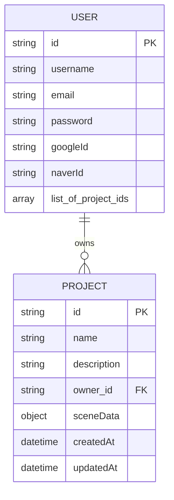

# LumoStage 프로젝트 데이터베이스 및 대시보드 설계

## 1. 개요

이 문서는 LumoStage 에디터의 작업 내용을 데이터베이스에 저장하고, 사용자가 자신의 프로젝트들을 관리할 수 있는 대시보드 기능을 구현하기 위한 전체적인 기술 설계를 정의합니다.

- **주요 기능:**
  - 사용자 계정 관리 (회원가입, 로컬 및 소셜 로그인)
  - 프로젝트 생성, 조회, 수정, 삭제 (CRUD)
  - 프로젝트 대시보드
  - 에디터와 데이터베이스 연동 (불러오기, 저장하기)

## 2. 데이터 모델링 (UML)

사용자(User)와 프로젝트(Project) 간의 관계는 1:N 입니다. 한 명의 사용자는 여러 개의 프로젝트를 가질 수 있습니다.



- `PROJECT.sceneData`는 조명, 카메라, 마네킹 위치/회전 등 에디터의 모든 상태를 포함하는 유연한 JSON 객체입니다.

## 3. 데이터베이스 스키마 (MongoDB / Mongoose)

`server/models/` 디렉토리 내에 생성될 Mongoose 스키마입니다.

### `User.js`

```javascript
const mongoose = require("mongoose");
const Schema = mongoose.Schema;

const UserSchema = new Schema(
  {
    username: { type: String, required: true, trim: true },
    email: { type: String, required: true, unique: true, trim: true },
    password: { type: String, required: false },
    googleId: { type: String, unique: true, sparse: true },
    naverId: { type: String, unique: true, sparse: true },
    projects: [{ type: Schema.Types.ObjectId, ref: "Project" }],
  },
  { timestamps: true }
);

module.exports = mongoose.model("User", UserSchema);
```

### `Project.js`

```javascript
const mongoose = require("mongoose");
const Schema = mongoose.Schema;

const ProjectSchema = new Schema(
  {
    name: { type: String, required: true, trim: true },
    description: { type: String, trim: true },
    owner: { type: Schema.Types.ObjectId, ref: "User", required: true },
    sceneData: { type: Object, required: true, default: {} },
    thumbnail: { type: String, default: "" },
  },
  { timestamps: true }
);

module.exports = mongoose.model("Project", ProjectSchema);
```

## 4. 서버 아키텍처 (MVCS 패턴)

서버는 **MVCS (Model-View-Controller-Service)** 패턴을 따릅니다. 이를 통해 코드의 관심사를 분리하고 유지보수성을 높입니다.

- **Model:** 데이터베이스 스키마를 정의합니다. (Mongoose 스키마)
- **View:** API 서버에서는 JSON 형태의 응답이 View 역할을 대신합니다.
- **Controller:** HTTP 요청을 받고, 요청에 대한 유효성 검사를 수행한 후, Service 계층에 비즈니스 로직 처리를 위임합니다. 처리 결과를 받아 클라이언트에게 응답(JSON)을 보냅니다.
- **Service:** 실제 비즈니스 로직을 수행합니다. Controller로부터 전달받은 데이터를 처리하고, 필요한 경우 Model을 통해 데이터베이스와 상호작용합니다.

### 서버 디렉토리 구조

```
server/
├── controllers/         # 컨트롤러 레이어
│   ├── auth.controller.js
│   └── project.controller.js
├── services/            # 서비스 레이어
│   ├── auth.service.js
│   └── project.service.js
├── models/              # 모델 레이어
│   ├── User.js
│   └── Project.js
├── routes/              # 라우팅
│   ├── index.js
│   ├── auth.routes.js
│   └── project.routes.js
├── config/              # 설정 파일
│   └── passport.js
├── tests/               # 테스트 코드
│   ├── auth.test.js
│   └── project.test.js
├── server.js            # 서버 진입점
└── ...
```

## 5. 테스트 전략 (TDD)

개발은 **TDD (Test-Driven Development)** 방식을 따릅니다. 실제 구현 코드보다 테스트 코드를 먼저 작성하여 요구사항을 명확히 하고, 코드의 안정성을 확보합니다.

- **테스트 프레임워크:** `Jest`
- **API 엔드포인트 테스트:** `Supertest`

### TDD 개발 흐름

1.  **(RED)** 실패하는 테스트 케이스를 작성합니다. (기능 요구사항 정의)
2.  **(GREEN)** 테스트를 통과하는 최소한의 코드를 작성합니다.
3.  **(REFACTOR)** 작성된 코드를 리팩토링하여 코드 품질을 개선합니다.
4.  모든 기능에 대해 위 과정을 반복합니다.

## 6. API 엔드포인트 설계

### 인증 API (`/api/auth`) (수정)

`passport.js`를 이용한 소셜 로그인 경로를 추가합니다.

| Method | Path               | 설명                                               | 인증 필요 |
| ------ | ------------------ | -------------------------------------------------- | --------- |
| `POST` | `/register`        | 신규 사용자 등록                                   | No        |
| `POST` | `/login`           | 사용자 로그인 (JWT 발급)                           | No        |
| `POST` | `/logout`          | 사용자 로그아웃                                    | Yes       |
| `GET`  | `/google`          | Google 로그인 시작 (Google 인증 페이지로 리디렉션) | No        |
| `GET`  | `/google/callback` | Google 로그인 후 콜백 처리                         | No        |
| `GET`  | `/naver`           | Naver 로그인 시작 (Naver 인증 페이지로 리디렉션)   | No        |
| `GET`  | `/naver/callback`  | Naver 로그인 후 콜백 처리                          | No        |

### 프로젝트 API (`/api/projects`)

| Method   | Path   | 설명                                 | 인증 필요         |
| -------- | ------ | ------------------------------------ | ----------------- |
| `GET`    | `/`    | 로그인된 사용자의 모든 프로젝트 조회 | Yes               |
| `POST`   | `/`    | 새 프로젝트 생성                     | Yes               |
| `GET`    | `/:id` | 특정 프로젝트 데이터 조회            | Yes (소유권 확인) |
| `PUT`    | `/:id` | 특정 프로젝트 데이터 업데이트(저장)  | Yes (소유권 확인) |
| `DELETE` | `/:id` | 특정 프로젝트 삭제                   | Yes (소유권 확인) |

## 7. 프론트엔드 아키텍처 변경

### 라우팅 (`react-router-dom`)

- **Public Routes:**
  - `/`: `HomePage` (기존 히어로 페이지)
  - `/login`: `LoginPage`
  - `/register`: `RegisterPage`
- **Private Routes (로그인 필요):**
  - `/projects`: `ProjectsDashboardPage` (프로젝트 목록 대시보드)
  - `/projects/:id`: `EditorPage` (기존 에디터를 동적으로 변경)

### 신규 페이지 및 컴포넌트 (수정)

- `pages/LoginPage.jsx` / `RegisterPage.jsx`: 사용자 인증 폼. **Google/Naver 로그인 버튼 추가.**
- `pages/ProjectsDashboardPage.jsx`: 사용자의 모든 프로젝트를 `ProjectCard`로 표시. '새 프로젝트 만들기' 기능 포함.
- `components/ProjectCard.jsx`: 프로젝트 이름, 설명, 썸네일 표시. 클릭 시 해당 에디터 페이지로 이동.
- `components/common/PrivateRoute.jsx`: 로그인되지 않은 사용자의 접근을 막고 로그인 페이지로 리디렉션하는 HOC.
- `components/common/Navbar.jsx`: 로그인 상태에 따라 '대시보드', '로그아웃' 또는 '로그인' 메뉴를 동적으로 표시.

### 상태 관리 (`zustand`)

`store.js`에 다음 비동기 액션 추가:

- `loadProject(projectId)`: `GET /api/projects/:id`를 호출하여 받은 `sceneData`로 스토어 상태를 덮어씀.
- `saveCurrentProject(projectId)`: 현재 스토어의 `sceneData`를 `PUT /api/projects/:id`로 전송하여 저장.
- `createNewProject(projectData)`: `POST /api/projects`를 호출하여 새 프로젝트를 생성하고, 반환된 ID로 에디터 페이지로 이동.
- 인증 관련 상태( `user`, `token`, `isAuthenticated`) 및 액션(`login`, `logout`, `register`) 추가.

## 8. 인증 흐름 (JWT + Passport.js)

### 로컬 인증

1.  **로그인:** 사용자가 이메일/비밀번호 제출 -> 서버에서 확인 후 JWT 발급.
2.  **토큰 저장:** 서버는 `HttpOnly` 쿠키에 JWT를 담아 클라이언트에 전송.
3.  **인증된 요청:** 클라이언트는 이후 모든 API 요청 시 브라우저에 의해 자동으로 쿠키를 함께 전송.
4.  **서버 검증:** 서버의 인증 미들웨어는 요청의 쿠키에서 JWT를 확인하고 유효성을 검증.
5.  **권한 부여:** 토큰이 유효하면 요청 객체에 사용자 정보를 추가하여 다음 핸들러로 전달.
6.  **로그아웃:** 클라이언트가 로그아웃 요청 -> 서버는 쿠키를 만료시켜 세션을 종료.

### 소셜 인증 (OAuth 2.0)

1.  **로그인 시작:** 사용자가 프론트엔드의 'Google/Naver로 로그인' 버튼 클릭.
2.  **백엔드 요청:** 프론트엔드는 `<a>` 태그나 `window.location.href`를 통해 백엔드의 `/api/auth/google` 또는 `/api/auth/naver`로 사용자를 이동시킴.
3.  **소셜사 리디렉션:** 백엔드의 `passport` 전략이 해당 소셜사의 인증 페이지로 사용자를 리디렉션.
4.  **사용자 인증:** 사용자는 소셜사 페이지에서 로그인하고 LumoStage 앱의 접근 권한을 승인.
5.  **콜백 처리:** 소셜사는 사용자를 백엔드의 `/api/auth/google/callback` (또는 naver) 경로로 리디렉션. 이 때 인증 코드를 함께 전달.
6.  **프로필 조회 및 사용자 처리:** 백엔드의 `passport` 콜백 핸들러가 인증 코드를 사용해 액세스 토큰을 받고, 이를 이용해 사용자 프로필(ID, 이메일 등)을 조회.
    - 기존에 해당 소셜 ID로 가입한 사용자가 있으면 해당 사용자로 로그인 처리.
    - 없으면, 받은 프로필 정보로 새로운 사용자를 데이터베이스에 생성한 후 로그인 처리.
7.  **JWT 발급 및 리디렉션:** 서버는 해당 사용자에 대한 JWT를 생성하여 `HttpOnly` 쿠키에 담아 응답하고, 사용자를 프론트엔드의 대시보드 페이지 (`/projects`)로 리디렉션.

## 9. 구현 계획 (To-Do List)

### ✅ Phase 1: 백엔드 구축 (TDD & MVCS 기반)

- [ ] `server` 디렉토리 생성 및 `npm init`
- [ ] 의존성 설치: `express`, `mongoose`, `bcryptjs`, `jsonwebtoken`, `cors`, `dotenv`, `passport`, `passport-google-oauth20`, `passport-naver-v2`
- [ ] **테스트 의존성 설치:** `jest`, `supertest`
- [ ] `jest` 및 `supertest` 설정 파일 구성
- [ ] MongoDB 연결 설정
- [ ] `models/User.js`, `models/Project.js` 스키마 파일 작성
- [ ] **Passport.js 설정 파일 생성 (`server/config/passport.js`)**

---

**Auth API (TDD Cycle)**

1.  **회원가입 (`POST /api/auth/register`)**

    - [ ] **[Test]** 회원가입 성공 및 실패 케이스 테스트 코드 작성 (`tests/auth.test.js`)
    - [ ] **[Implement]** `auth.routes.js`, `auth.controller.js`, `auth.service.js` 파일 생성
    - [ ] **[Implement]** 테스트를 통과하는 최소한의 회원가입 로직 구현 (비밀번호 해싱 포함)
    - [ ] **[Refactor]** 코드 리팩토링

2.  **로그인 (`POST /api/auth/login`)**

    - [ ] **[Test]** 로그인 성공 및 실패 케이스 테스트 코드 작성
    - [ ] **[Implement]** 테스트를 통과하는 로그인 로직 구현 (JWT 발급)
    - [ ] **[Refactor]** 코드 리팩토링

3.  **소셜 로그인 (Google)**
    - [ ] **[Test]** Google 로그인 콜백 처리 테스트 케이스 작성 (Mock Strategy 사용)
    - [ ] **[Implement]** Passport Google 전략 설정 및 콜백 로직 구현
    - [ ] **[Refactor]** 코드 리팩토링

---

**Project API (TDD Cycle)**

1.  **프로젝트 생성 (`POST /api/projects`)**

    - [ ] **[Test]** 인증된 사용자의 프로젝트 생성 테스트 코드 작성 (`tests/project.test.js`)
    - [ ] **[Implement]** `project.routes.js`, `project.controller.js`, `project.service.js` 파일 생성
    - [ ] **[Implement]** 테스트를 통과하는 프로젝트 생성 로직 구현
    - [ ] **[Refactor]** 코드 리팩토링

2.  **(이하 생략)** 모든 프로젝트 API에 대해 TDD 사이클 반복

---

### ✅ Phase 2: 프론트엔드 기본 설정

- [ ] `react-router-dom`, `axios` 의존성 설치
- [ ] `App.jsx`에 라우터 설정
- [ ] `LoginPage.jsx`에 Google/Naver 로그인 버튼 추가
- [ ] Zustand 스토어에 인증 관련 상태 및 액션 추가

### ✅ Phase 3: 프로젝트 대시보드 구현

- [ ] `ProjectsDashboardPage.jsx` 및 `ProjectCard.jsx` 컴포넌트 생성
- [ ] 대시보드 페이지에서 `GET /api/projects` API 호출 및 목록 렌더링
- [ ] '새 프로젝트 만들기' 기능 구현

### ✅ Phase 4: 에디터 연동

- [ ] `EditorPage`를 `/projects/:id` 경로와 연동
- [ ] `loadProject` 및 `saveCurrentProject` 액션 구현

### ✅ Phase 5: 최종 정리

- [ ] `Navbar` 동적 메뉴 및 로그아웃 기능 구현
- [ ] 전체 사용자 흐름 테스트 (로컬 및 소셜 로그인 포함)
