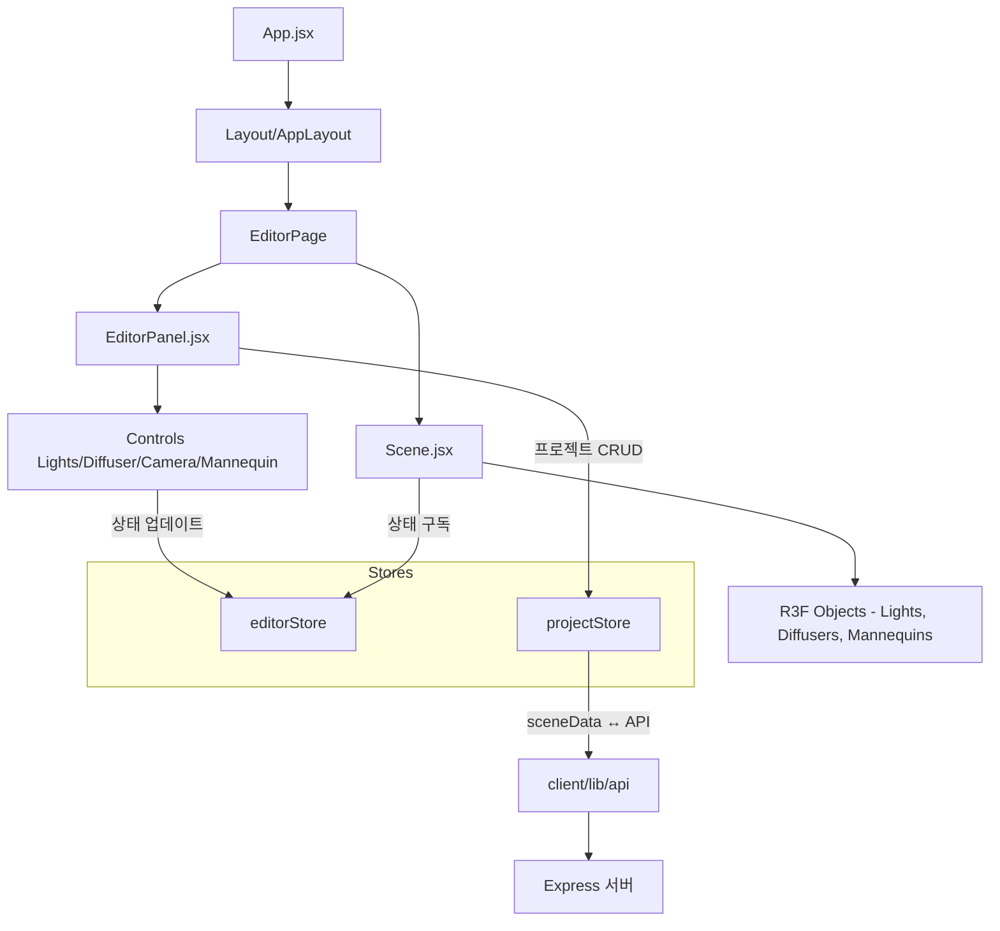
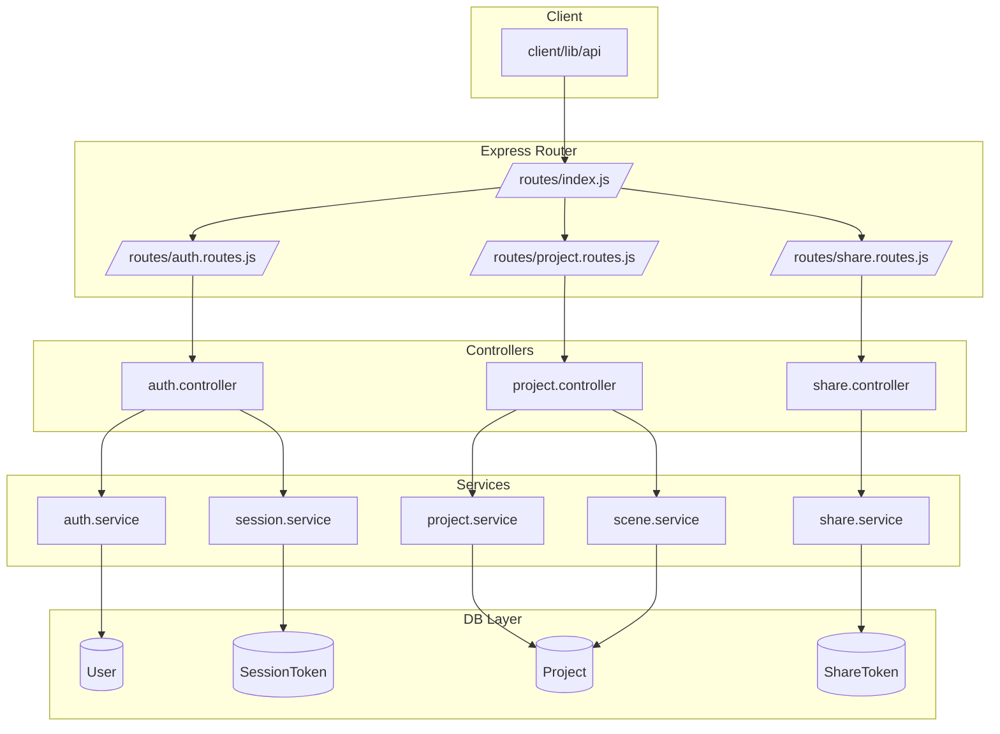
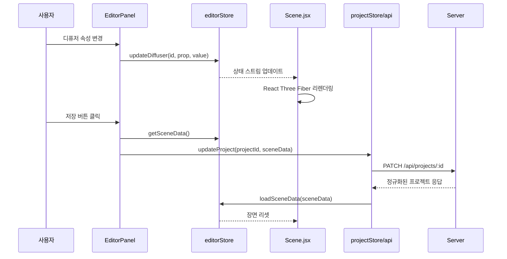

# LumoStage 프로젝트 학습 노트

이 문서는 LumoStage 코드베이스를 빠르게 이해하기 위한 요약 자료입니다. 주요 기능이 어디에 구현되어 있고, 컴포넌트·스토어·API 간에 어떤 흐름으로 동작하는지 정리했습니다.

## 1. 핵심 구조 개요

- **EditorPanel.jsx**: 편집 UI의 루트. 조명/디퓨저/카메라/마네킹 컨트롤을 포함합니다.
- **Scene.jsx**: 실시간 3D 씬을 렌더링합니다. `editorStore`의 상태를 구독해 Three.js 객체를 업데이트합니다.
- **editorStore** (`client/src/store/editorStore.js`): 조명·디퓨저·카메라·마네킹 상태를 관리하는 Zustand 스토어입니다.
- **projectStore** (`client/src/store/projectStore.js`): 프로젝트 CRUD 및 서버와의 데이터 동기화를 담당합니다.

## 2. 주요 스토어와 상태

### editorStore (client/src/store/editorStore.js)

- **lights**: 조명 배열. `addLight`, `deleteLight`, `updateLight` 등 액션으로 수정됩니다.
- **diffusers**: 디퓨저 배열. `addDiffuser`, `deleteDiffuser`, `linkDiffuserToLight` 등 액션 제공.
- **cameraState**: 카메라 위치, 타깃, focalLength를 포함.
- **mannequins**: 마네킹 위치와 포즈 정보를 저장.
- **getSceneData / loadSceneData**: Scene 데이터를 직렬화/역직렬화해 프로젝트 저장·로드에 사용.

### projectStore (client/src/store/projectStore.js)

- `fetchProjects`, `createProject`, `getProjectById`, `updateProject`, `deleteProject`: REST API 래퍼.
- `updateProject` 호출 시 `editorStore.getSceneData()` 결과를 서버로 전송해 Scene을 저장합니다.
- 응답받은 프로젝트 데이터의 `sceneData`를 `editorStore.loadSceneData()`에 넘겨 씬을 재구성합니다.

## 3. 주요 컴포넌트 책임

- **LightsControl.jsx / LightCard.jsx**: 조명 추가·선택·속성 제어 UI. `editorStore` 액션을 직접 호출합니다.
- **DiffuserControl.jsx**: 디퓨저 속성 편집 및 조명 연결/차단. `linkDiffuserToLight`, `blockOriginalLight` 플래그 등을 제어합니다.
- **CameraControl.jsx**: 카메라 위치/화각/초점거리 변경.
- **Scene.jsx**: `TransformControls`로 객체 이동/회전/스케일 변경 이벤트를 받아 스토어에 반영합니다. `useSceneSelection` 훅으로 클릭 대상 선택을 관리합니다.
- **Diffuser.jsx / Mannequin.jsx**: 씬 내 R3F 오브젝트. 스토어 상태 기반으로 머티리얼·포즈를 업데이트합니다.

## 4. 서버 측 동작 흐름

- **auth**: 로그인/회원가입 시 CSRF 토큰(`server/middleware/csrf.middleware.js`)과 세션 토큰(`SessionToken` 모델)을 발급합니다.
- **projects**: `server/routes/project.routes.js` → `controllers/project.controller.js` → `services/project.service.js` 순으로 요청을 처리합니다.
  - `scene.service.normalizeSceneData()`가 `diffusers`, `lights`, `mannequins`를 정규화하며 프로젝트 간 상태 오염을 방지합니다.
- **share**: `/api/share/projects/:id`에서 공유 토큰을 발급하고, `/api/share/:token`으로 조회합니다.

### 4.1 서버 API 레이어 다이어그램

## 5. 이벤트 전파 예시

## 6. 참고 파일

- `docs/PRD.md`: 제품 요구사항과 사용자 여정, 시스템 아키텍처 다이어그램.
- `docs/LumoStage-Architecture.md`: 세부 아키텍처 시나리오 및 3D 상호작용 정의.
- `client/src/components/editor/useSceneSelection.js`: 씬 내 객체 선택 로직.
- `server/services/session.service.js`: 세션 토큰 발급/회전/폐기 처리.

---

추가 학습이 필요한 경우 이 문서에 섹션을 덧붙이거나, 각 파일에 주석을 참고하세요.
