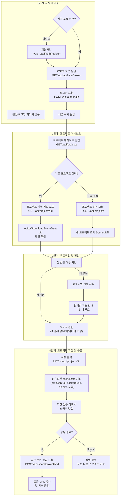
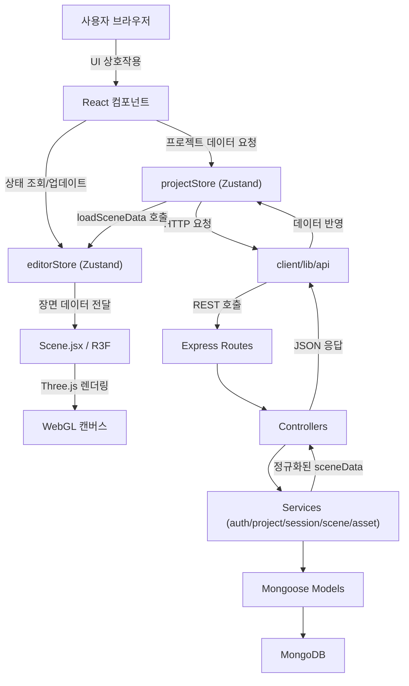
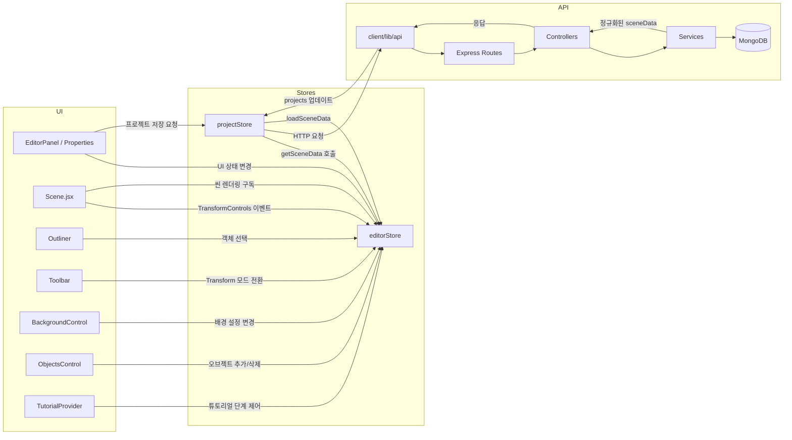

# LumoStage: 3D 조명 시뮬레이션 웹 앱 - PRD

**문서 버전:** 2.0
**최종 수정일:** 2025년 11월 3일
**프로젝트 오너:** 김재준

## 1. 개요 (Overview)

### 1.1. 프로젝트명: LumoStage

### 1.2. 비전

영상 및 영화 제작자들이 실제 촬영에 들어가기 전, 웹 브라우저에서 간편하게 조명과 카메라 구도를 시뮬레이션하여 시간과 비용을 절약하고 창의적인 결과물을 만들 수 있도록 돕는 전문 3D 시뮬레이션 툴. 3D 프로그램 경험이 없는 초보자도 쉽게 접근할 수 있으면서, 전문가들에게는 Cinema 4D, Blender와 같은 전문 툴의 워크플로우를 제공합니다.

### 1.3. 문제점

- 실제 촬영 현장에서 조명을 설치하고 테스트하는 데 많은 시간과 인력이 소모된다.
- 고가의 3D 소프트웨어는 사용법이 복잡하고 접근성이 낮아, 독립 영화 제작자나 학생, 유튜버들이 사용하기 어렵다.
- 팀원 간의 조명/카메라 구도에 대한 커뮤니케이션이 텍스트나 그림만으로는 명확하지 않다.
- 기존 웹 기반 3D 툴들은 초보자를 위한 온보딩이나 튜토리얼이 부족하다.
- 실제 촬영 환경을 재현하기 위한 배경(HDRI) 및 추가 오브젝트 배치 기능이 제한적이다.

### 1.4. 해결 방안

MERN 스택과 Three.js (React-Three-Fiber)를 활용하여, 사용자가 웹에서 실시간으로 3D 공간에 오브젝트를 배치하고, 여러 개의 조명을 설치하며, 가상 카메라를 통해 결과물을 확인할 수 있는 웹 애플리케이션을 개발합니다. 단계적 튜토리얼 시스템으로 신규 사용자의 진입 장벽을 낮추고, 전문가를 위한 레이어 기반 UI와 Undo/Redo 시스템으로 효율적인 작업 환경을 제공합니다.

### 1.5. 타겟 사용자

**주요 타겟:**

- 영화/영상 전공 학생 (3D 툴 경험 적음)
- 독립 영화 제작자 및 촬영감독 (전문가)
- 영상 콘텐츠 크리에이터 (유튜버, 프리랜서)

**부가 타겟:**

- 조명 디자이너
- 무대 연출가
- 건축/인테리어 시각화 전문가

### 1.6 시장 기회 및 성장성

- 전 세계 3D 시뮬레이션 소프트웨어 시장은 2024년 기준 147~168억 달러 규모로 추정되며 2025~2033년 연평균 15.4~20.4% 성장이 예상된다. 조명 설계 소프트웨어만 놓고 보더라도 2024년 15억 달러에서 2029년 22억 달러까지 확대될 전망이다.
- 뉴욕·뉴저지·캘리포니아 주 세금 인센티브 강화로 미국 독립 영화 제작 투자가 확대되고 있으며, 10만~25만 명의 제작자가 프로젝트당 10만~25만 달러 규모의 마이크로/로우버짓 제작을 시도하고 있다. 촬영 전 시각화 도구에 대한 비용 대비 효율성 요구가 증가하고 있다.
- 원격 협업과 웹 기반 CAD 도입률 상승으로 설치형 툴 대비 브라우저 접근성을 갖춘 도구 수요가 증가하고 있다. 특히 중소규모 제작사와 교육기관에서 웹 기반 워크플로우 전환이 가속화되고 있다.

### 1.7 주요 고객 세그먼트 규모 및 니즈

- **영화/영상 전공 학생 (~50만 명, 연간 도구 예산 $0-100):** 고가 소프트웨어에 접근하기 어려워 실습 기회가 제한된다. 브라우저 기반으로 즉시 접근하고 단계별 튜토리얼로 학습 곡선을 낮추는 솔루션을 요구한다.
- **독립 영화 제작자 및 촬영감독 (10만~25만 명, 프로젝트당 도구 예산 $100-500):** 한정된 제작비와 타이트한 일정 속에서 촬영 전 조명 실험과 팀 커뮤니케이션 효율화를 최우선 과제로 본다. 반복 가능한 프로젝트 저장과 공유 기능이 필요하다.
- **전문 유튜브 크리에이터 (250만 명 이상, 고품질 영상 제작 압박):** 짧은 제작 주기 안에 시네마틱 퀄리티를 확보해야 하므로 빠른 프리비즈와 템플릿 재사용성이 중요하다. 4K 이상 품질을 위한 조명 시뮬레이션과 협업 노트 기능을 기대한다.
- 위 세그먼트 모두 저비용·고효율·직관적 인터페이스를 핵심 가치로 인식하고 있으며, 프리미엄 기능에 대한 지불 의사도 반복 작업과 시간 절감 효과가 명확할 때 형성된다.

### 1.8 경쟁 포지셔닝 요약

- **설치형 전문 툴**(Set.a.light 3D, Shot Designer, Cine Designer 등)은 사실적인 렌더링과 카메라 블로킹 기능을 제공하지만 높은 구매 비용과 복잡한 설치·학습 과정이 존재한다.
- **범용 3D 툴**(Blender, Unreal Engine)은 무료 또는 강력한 기능을 제공하지만, 가파른 학습 곡선과 조명 프리비즈에 특화되지 않은 워크플로우가 진입 장벽이다.
- **LumoStage의 핵심 차별점**은 브라우저 기반 실시간 3D 렌더링, 초보자용 온보딩, 프로젝트 중심 협업 기능이다. MERN 스택을 활용해 향후 팀 공유, 버전 관리, AI 조명 추천 등 SaaS형 확장이 용이하다.
- 경쟁 제품 대비 렌더 품질과 전문 기능 깊이에서 도전 과제가 남아 있으나, "5분 만에 시작하는 웹 기반 프리비즈" 포지셔닝으로 빠른 실험과 협업을 원하는 고객층을 선점할 수 있다.

## 2. 목표 (Goals)

### 2.1. 제품 목표

- 사용자는 3D 공간에서 기본적인 조명(Key, Fill, Back) 설정을 시뮬레이션할 수 있다.
- 사용자는 가상 카메라의 위치와 각도를 조절하여 원하는 샷을 미리 볼 수 있다.
- 모든 시뮬레이션 과정은 실시간으로 렌더링되어 즉각적인 피드백을 제공한다.
- 신규 사용자는 5분 이내에 튜토리얼을 통해 핵심 기능을 익힐 수 있다.
- 전문가는 Cinema 4D와 유사한 Outliner, Properties Panel을 통해 효율적으로 작업할 수 있다.
- 사용자는 HDRI 배경과 3D 오브젝트를 추가하여 실제 촬영 환경을 재현할 수 있다.

### 2.2. 기술 목표

- React와 React-Three-Fiber를 사용하여 인터랙티브한 3D UI/UX를 구현한다.
- Node.js/Express로 Scene(장면) 데이터를 저장하고 불러올 수 있는 안정적인 API를 구축한다.
- MongoDB를 사용하여 유연한 구조의 Scene 데이터를 관리한다.
- Zustand 중앙 상태 관리를 통해 단방향 데이터 흐름을 유지한다.

### 2.3. 사업 목표

- 제품 초기 6개월 내 무료→유료 전환율 5% 달성 (크리에이티브 SaaS 평균 3~6% 대비 우위 확보).
- 월간 활성 사용자 대비 30% 이상이 팀 협업 기능(공유 토큰, 주석 등)을 활용하도록 유도해 업셀링 기반을 마련한다.
- 출시 12개월 내 월 반복 수익(MRR) 2만 달러 달성과 함께 고객 유지율 85% 이상을 유지한다.

### 2.4. 수익화 전략 개요

- **프리미엄(Freemium) 모델**을 채택하고 무료 플랜에는 조명 3개, 프로젝트 1개, 워터마크 내보내기 제한을 둔다.
- **프로 플랜**은 월 $15~25 가격 구간에서 무제한 조명·프로젝트·고해상도 렌더·팀 공유 기능을 제공한다.
- 고급 고객(스튜디오, 교육 기관)을 위한 **팀/교육 플랜**은 좌석 단위 요금과 전용 온보딩을 제공하며, 결제 흐름은 셀프서비스를 기본으로 하고 필요 시 세일즈 어시스트를 붙인다.
- 가격·기능 조합과 전환율 가설, 근거 데이터는 `docs/LumoStage PRD Enhancement Report.md`의 비즈니스 모델 장을 따라 지속 검증한다.

## 3. 사용자 스토리 (User Stories)

### 3.1. 기존 사용자 스토리

- (연출가로서) 나는 3D 공간에 **마네킹 모델**을 배치하여, 조명이 피사체에 어떻게 영향을 미치는지 확인하고 싶다.
- (촬영감독으로서) 나는 여러 종류의 조명(점 조명, 스포트라이트, 주변광)을 추가하고, 각 조명의 위치, 색상, 강도를 조절하여 원하는 분위기를 만들고 싶다.
- (감독으로서) 나는 가상 카메라를 자유롭게 움직이고 렌즈 화각(FOV)을 조절하여, 다양한 앵글과 샷 사이즈를 테스트하고 싶다.
- (사용자로서) 나는 내가 작업한 조명 및 카메라 설정을 'Scene'으로 저장하고, 나중에 다시 불러와서 수정하고 싶다.

### 3.2. 신규 사용자 스토리

**온보딩 및 사용성:**

- (초보자로서) 나는 처음 에디터에 진입했을 때 단계별 튜토리얼을 통해 기본 기능을 빠르게 익히고 싶다.
- (사용자로서) 나는 키보드 단축키를 통해 반복 작업을 빠르게 수행하고 싶다.
- (사용자로서) 나는 실수를 되돌릴 수 있는 Undo/Redo 기능이 필요하다.

**카메라 및 뷰포트:**

- (촬영감독으로서) 나는 OrbitControls로 탐색한 시점을 카메라 뷰로 설정하고 싶다. (Cinema 4D 스타일)
- (사용자로서) 나는 프로젝트를 저장할 때 현재 카메라 위치도 함께 저장되기를 원한다.
- (사용자로서) 나는 Grid와 Snap 기능을 활용하여 객체를 정확하게 배치하고 싶다.

**씬 구성:**

- (촬영감독으로서) 나는 HDRI 배경 이미지를 업로드하여 실제 촬영 환경과 유사한 조명 환경을 만들고 싶다.
- (사용자로서) 나는 배경색을 변경하거나 Ground plane의 반사도를 조정하여 원하는 분위기를 연출하고 싶다.
- (미술 감독으로서) 나는 3D 오브젝트(GLTF 파일)를 업로드하여 실제 세트나 소품을 시뮬레이션하고 싶다.
- (사용자로서) 나는 프리미티브 오브젝트(큐브, 구, 실린더)를 빠르게 추가하여 간단한 구조물을 만들고 싶다.

**전문가 워크플로우:**

- (전문가로서) 나는 Outliner를 통해 씬의 모든 객체를 계층 구조로 보고 관리하고 싶다.
- (전문가로서) 나는 Properties Panel에서 선택된 객체의 모든 속성을 한 곳에서 상세히 편집하고 싶다.
- (전문가로서) 나는 하단 Toolbar에서 자주 사용하는 도구(이동, 회전)에 빠르게 접근하고 싶다.
- (전문가로서) 나는 객체를 복사하거나 숨김/잠금 처리하여 복잡한 씬을 효율적으로 관리하고 싶다.

**AI 기능 (추후):**

- (사용자로서) 나는 Google Nano Banana API를 활용하여 텍스트 프롬프트로 조명 레퍼런스 이미지를 생성하고 싶다.

### 3.3. 사용자 여정 플로우



## 4. MVP 기능 명세 (MVP Feature Specifications)

### 4.1. 3D 뷰포트 (Viewport)

- Three.js 기반의 3D 캔버스가 화면의 중심을 차지한다.
- `@react-three/drei`의 `OrbitControls`를 통해 마우스로 화면 제어(궤도 회전, 확대/축소, 이동)가 가능하다.
- 기본적인 3D 환경: 바닥(Plane)과 중심에 **나무 마네킹(Wooden Mannequin) GLTF 모델**이 존재한다.
- **새로 추가**: OrbitControls의 카메라 위치와 타겟이 프로젝트에 저장되어, 로드 시 동일한 시점으로 복원된다.

### 4.2. 조명 제어 (Light Controls)

**UI:** 화면 우측에 위치한 컨트롤 패널 (`EditorPanel.jsx`) 또는 Properties Panel.
**상태 관리:** `Zustand`를 사용한 중앙 집중식 상태 관리 (`store.js`).

**기능:**

- **조명 추가:** `LightCard` 리스트에서 조명 유형(point, spot, directional, rect)에 따라 프리셋을 생성한다.
- **조명 목록:** 현재 Scene에 추가된 조명들이 카드 형태로 표시되며, 선택된 조명은 TransformControls와 연동된다.
- **조명 삭제:** 각 조명 카드에서 '삭제' 버튼으로 Scene의 조명을 제거할 수 있다.
- **속성 제어:** 선택된 조명의 속성(위치, 색상, 강도, 각도/펜움브라, 타깃 위치 등)을 슬라이더와 컬러 피커로 실시간 제어한다. 모든 변경사항은 `editorStore`를 통해 3D Scene에 즉시 반영된다.
- **레이어링:** 레터박스 오버레이(`LetterboxOverlay.jsx`)를 통해 카메라 비율 변경 시 프레임 가이드를 제공한다.

### 4.3. 디퓨저 시스템 (Diffuser System)

**UI:** `DiffuserControl.jsx` 섹션.
**상태 관리:** `editorStore`의 `diffusers` 슬라이스.

**기능:**

- **디퓨저 생성/삭제:** `addDiffuser`/`deleteDiffuser` 액션을 통해 독립적인 디퓨저 객체를 생성‧제거한다. 각 객체는 `nanoid()` 기반 고유 ID를 갖는다.
- **속성 제어:** 위치, 회전, 스케일, 투과율, 두께, 러프니스, 2차 광원 강도 등을 조절하며, 모든 변경은 Three.js `Mesh`에 즉시 반영된다.
- **조명 연동:** 특정 조명 ID 배열(`linkedLightIds`)을 통해 디퓨저가 필터링할 빛을 선택하고, 원본 광원 차단 여부(`blockOriginalLight`)를 토글할 수 있다.
- **장면 반영:** Scene 내 `Diffuser.jsx` 컴포넌트가 `R3F` 머티리얼 파라미터를 업데이트하여 실제 광량 변화가 시각화된다.

### 4.4. 카메라 제어 (Camera Controls)

**UI:** 컨트롤 패널 내 별도 섹션.
**상태 관리:** **`Zustand`** Store에서 카메라 상태 관리.

**기능:**

- **카메라 위치 (Position):** X, Y, Z 축 슬라이더로 카메라의 위치를 조정한다.
- **화각 (Field of View) 및 초점거리:** 슬라이더를 통해 렌즈의 화각을 조절하고, `cameraState.focalLength`로 시네마틱 대응값을 유지한다.
- **뷰 모드 전환:** Free/Camera 뷰 모드를 전환하여 OrbitControls와 카메라 프레임 사이를 전환한다.
- **새로 추가: Camera-Orbit 동기화:**
  - "Set Camera to View" 버튼: 현재 OrbitControls 위치를 Camera View로 설정
  - "View from Camera" 버튼: Camera View 위치로 OrbitControls 이동

### 4.5. 프로젝트 기반 Scene 저장 및 불러오기

**UI:** 컨트롤 패널 상단에 '저장' 버튼.

**기능:**

- **저장:** `editorStore.getSceneData()`가 반환하는 장면 정보를 `projectStore.updateProject()`를 통해 `PATCH /api/projects/:id`로 전송한다. 서버는 정규화된 `sceneData`를 저장하고 최신 프로젝트 정보를 반환한다.
- **불러오기:** 프로젝트 상세 진입 시 `GET /api/projects/:id` 응답의 `sceneData`를 `editorStore.loadSceneData()`가 파싱하여 `lights`, `diffusers`, `mannequins`, `cameraState`, `orbitControlState`, `backgroundSettings`, `objects`, `aspectRatio`를 초기화한다.
- **락 방지:** 각 프로젝트는 고유한 상태를 보유하며, 서버 정규화 로직이 프로젝트 간 상태 공유를 차단한다.

### 4.6. 튜토리얼 시스템

**목표:** 신규 사용자가 5분 이내에 핵심 기능을 익히고 첫 프로젝트를 저장할 수 있도록 지원.

**구조:** 8단계 인터랙티브 튜토리얼

1. **Welcome**: 환영 메시지 및 시작 안내 (Dialog)
2. **3D Viewport 조작**: 마우스 드래그, 줌 실습 (Spotlight Effect)
3. **조명 추가**: "조명 추가" 버튼 강조 및 실제 추가 유도 (Tooltip + Arrow)
4. **조명 속성 조정**: 슬라이더 조작 실습 (Popover)
5. **카메라 뷰 설정**: Camera-Orbit Sync 기능 안내 ("Set Camera to View", "View from Camera" 버튼 설명)
6. **마네킹 포즈 변경**: 프리셋 선택 실습 (Tab 전환 안내)
7. **프로젝트 저장**: 저장 버튼 클릭 안내 (Header 강조)
8. **완료 및 단축키 안내**: 축하 메시지 + 단축키 카드 (Dialog)

**기능:**

- 언제든 건너뛰기 가능 (`ESC` 키 또는 "나중에" 버튼)
- `localStorage`에 튜토리얼 상태 저장 (완료/건너뛰기 기록)
- `?` 키로 단축키 카드 재열람
- `H` 키로 튜토리얼 재시작

**UI 컴포넌트:**

- TutorialProvider (Context API)
- TutorialOverlay (반투명 배경)
- TutorialDialog, TutorialTooltip, TutorialSpotlight
- KeyboardShortcutsCard (단축키 전체 목록)

### 4.7. 배경 시스템 (Background System)

**목표:** 실제 촬영 환경을 재현할 수 있는 배경 설정 제공.

**기능:**

- **배경 타입 선택:**
  - Solid Color: 단색 배경 (색상 피커)
  - HDRI: 환경 맵 이미지 업로드 (.hdr, .exr)
  - None: 배경 없음 (투명)
- **HDRI 환경광:**
  - Intensity 슬라이더로 환경광 강도 조절
  - HDRI 이미지가 Scene의 `environment`로 설정되어 자연스러운 반사/조명 제공
- **Ground Plane 설정:**
  - 표시/숨김 토글
  - 색상 선택
  - 반사도(Reflectivity) 조절 (0~1)

**상태 관리:**

```javascript
backgroundSettings: {
  type: 'color' | 'hdri' | 'none',
  color: '#1a1a1a',
  hdriUrl: null,
  hdriIntensity: 1,
  showGround: true,
  groundColor: '#808080',
  groundReflectivity: 0.3,
}
```

**파일 업로드:**

- **클라이언트**: 파일 선택 → FormData로 서버에 업로드 요청
- **서버 처리 흐름**:
  1. Multer로 파일 수신 (메모리 버퍼 또는 임시 디스크)
  2. 파일 검증 (형식: .hdr, .exr / 크기: 최대 50MB)
  3. Cloudflare R2에 업로드 (S3 호환 API 사용)
  4. 공개 URL 생성 및 Asset 모델에 저장
  5. URL을 클라이언트에 반환 → `backgroundSettings.hdriUrl`에 저장
- **R2 버킷 구조**: `lumo-stage-assets/hdri/{userId}/{projectId}/{fileName}`
- **파일 삭제**: 프로젝트 삭제 시 연결된 HDRI 파일도 R2에서 삭제 (cascade)

### 4.8. 3D Object 관리 시스템

**목표:** 조명 외에 3D 오브젝트를 배치하여 복잡한 씬 구성 가능.

**기능:**

- **프리미티브 오브젝트 추가:**
  - Cube, Sphere, Cylinder, Plane
  - 버튼 클릭으로 즉시 추가
- **GLTF/GLB 파일 업로드:**
  - **클라이언트**: 파일 선택 → FormData로 서버에 업로드 요청
  - **서버 처리 흐름**:
    1. Multer로 파일 수신
    2. 파일 검증 (형식: .gltf, .glb / 크기: 최대 100MB)
    3. Cloudflare R2에 업로드
    4. 공개 URL 생성 및 Asset 모델에 저장
    5. URL을 클라이언트에 반환 → 씬에 배치
  - **R2 버킷 구조**: `lumo-stage-assets/gltf/{userId}/{projectId}/{fileName}`
  - **최적화**: Draco 압축 권장, 파일 크기 경고 표시
- **Transform 조작:**
  - Position, Rotation, Scale 슬라이더
  - TransformControls와 연동 (W: 이동, E: 회전)
- **Material 설정:**
  - Color, Metalness, Roughness 조절
  - Cast Shadow, Receive Shadow 토글
- **객체 선택 및 관리:**
  - 3D Viewport에서 클릭하여 선택
  - 선택된 객체는 Properties Panel에 속성 표시
  - 삭제, 복제 기능 (추후 확장)

**상태 관리:**

```javascript
objects: [
  {
    id: "obj_abc123",
    name: "Cube 1",
    type: "primitive" | "gltf",
    primitiveType: "box" | "sphere" | "cylinder" | "plane",
    gltfUrl: null,
    position: [0, 0, 0],
    rotation: [0, 0, 0],
    scale: [1, 1, 1],
    material: { color, metalness, roughness },
    castShadow: true,
    receiveShadow: true,
  },
];
```

### 4.9. 프로페셔널 UI 시스템 (전문가용)

**목표:** Cinema 4D, Blender와 유사한 레이어 기반 UI로 전문가 워크플로우 지원.

**레이아웃:**

```
┌─────────────────────────────────────────────────────────────┐
│  Header (h-14) - 고정                                        │
│  [Logo] [프로젝트명] [저장] [공유] [도움말]                  │
├────────────────┬───────────────────────┬─────────────────────┤
│  Outliner      │   3D Viewport         │  Properties Panel   │
│  (w-64, 256px) │   (flex-1)            │  (w-80, 320px)      │
│                │                       │                     │
│  ├ Scene       │   [OrbitControls]     │  ┌────────────────┐ │
│  ├ Lights      │                       │  │ Transform      │ │
│  ├ Mannequins  │                       │  │ Light Settings │ │
│  ├ Objects     │                       │  │ Material       │ │
│  └ Camera      │                       │  └────────────────┘ │
├────────────────┴───────────────────────┴─────────────────────┤
│  Toolbar (h-10) - 고정                                       │
│  [W] [E] [Grid] [Snap] | [Undo] [Redo] | [?]                │
└─────────────────────────────────────────────────────────────┘
```

**주요 패널:**

**A. Outliner (좌측)**

- 씬의 모든 객체를 계층 트리로 표시
- 아이콘: 카메라 📷, 조명 💡, 마네킹 🧍, 오브젝트 🟦
- 클릭 시 선택 → 3D 씬 강조 + Properties Panel 업데이트
- 우클릭 컨텍스트 메뉴: 복사, 삭제, 이름 변경
- 가시성 토글 (눈 아이콘), 잠금 (자물쇠 아이콘)
- 드래그 앤 드롭으로 렌더 순서 변경
- 검색 및 필터링

**B. Properties Panel (우측)**

- 선택된 객체의 모든 속성을 상세히 편집
- Accordion 기반 섹션 구조:
  - Object Info (이름, 타입, ID)
  - Transform (Position, Rotation, Scale)
  - Light Settings (조명인 경우: Color, Intensity, Distance, Decay)
  - Material (오브젝트인 경우: Color, Metalness, Roughness)
  - Shadow (Cast Shadow, Shadow Bias, Shadow Map Size)
- 인라인 편집: 객체 이름 더블클릭으로 수정
- 숫자 입력 + 슬라이더 병행
- 프리셋 저장/불러오기 (추후)

**C. Toolbar (하단)**

- Transform 모드: W (이동), E (회전), R (스케일 - 추후)
- 뷰포트 옵션: Grid 표시, Snap to Grid
- 편집: Undo/Redo (Zustand temporal middleware)
- 도움말: `?` 키로 단축키 카드

**마이그레이션 전략:** 점진적 전환

- Phase 2.1: Outliner 추가 (기존 EditorPanel 유지)
- Phase 2.2: Properties Panel 전환 (기존 탭 시스템 제거)
- Phase 2.3: Toolbar 추가
- Phase 2.4: 패널 접기/펼치기 기능

### 4.10. AI 프리비주얼 이미지 생성 (추후 확장)

**목표:** 3D 조명 씬을 실사 이미지로 변환하여 영화 스토리보드 프리비주얼 제작.

**핵심 개념:**

"Scene-to-Photo": 사용자가 LumoStage에서 설정한 조명, 카메라 각도, 마네킹 포즈를 바탕으로 Google Nano Banana API를 활용하여 실사처럼 렌더링된 이미지를 생성합니다.

**워크플로우:**

1. 사용자가 3D 씬에서 조명, 카메라, 마네킹 포즈 설정
2. Canvas API로 현재 3D 씬을 이미지(PNG/JPG)로 캡처
3. 사용자가 프롬프트 입력 (예: "cinematic portrait, studio lighting, professional photography")
4. Google Nano Banana API가 3D 씬의 조명/구도를 유지하면서 실사 이미지 생성
5. 생성된 프리비주얼을 프로젝트에 연결하여 스토리보드로 활용

**UI 컴포넌트:**

- `PrevisualizationPanel.jsx`: AI 이미지 생성 전용 패널
- "Generate Previsualization" 버튼
- 프롬프트 입력 텍스트 영역 (최대 1000자)
- 네거티브 프롬프트 (선택)
- 파라미터 조정 슬라이더 (strength, steps, guidance scale)
- 생성 진행 상태 (Progress Bar)
- 히스토리: 과거 생성된 프리비주얼 썸네일 목록

**기능:**

- **사용자 API 키 관리**: 개인 Google Nano Banana API 키 입력 및 저장 (AES-256 암호화)
- **비동기 생성**: Bull Queue를 통한 백그라운드 작업 처리 (평균 30초)
- **프롬프트 Iterate**: 동일한 씬에서 프롬프트만 변경하여 재생성
- **히스토리 관리**: 프로젝트별 프리비주얼 생성 히스토리 조회/삭제

**사용 사례:**

- 영화 제작 프리프로덕션: 촬영 전 조명 테스트 → 실사 프리비주얼로 감독/촬영감독과 커뮤니케이션
- 유튜버 콘텐츠 기획: 조명 세팅을 미리 시뮬레이션 → 실제 촬영 환경 예측
- 학생 포트폴리오: 조명 디자인 작업물을 실사 이미지로 변환하여 포트폴리오 제작

**Note:** Phase 7 (AI 기능)에서 구현 예정. 자세한 API 설계는 `docs/api/AI_PREVISUALIZATION_API.md` 참고.

## 5. 기술 스택 및 아키텍처 (Tech Stack & Architecture)

### 5.1. 기술 스택

- **Frontend**: React, Vite, Zustand, Framer Motion
- **3D**: Three.js, React-Three-Fiber, React-Three-Drei
- **Styling**: Tailwind CSS, shadcn/ui
- **Backend**: Node.js, Express
- **Database**: MongoDB (Mongoose ODM 사용)
- **File Storage**: Cloudflare R2 (GLTF, HDRI 파일 저장용)
- **Authentication**: Session (express-session + MongoDB) + Passport.js (Google/Naver OAuth)
- **File Upload**: Multer + @aws-sdk/client-s3 (S3 호환 API로 Cloudflare R2 연동)

### 5.2. 아키텍처 및 컴포넌트 흐름

LumoStage는 클라이언트-서버 구조 위에 Three.js 렌더링 계층을 올린 형태다. 프론트엔드는 Zustand 스토어를 단일 진실 소스로 사용하며, 서버는 MVCS 패턴으로 프로젝트 단위 데이터를 정규화한다.

```
App.jsx
└─ Layout/AppLayout
   └─ EditorPage (client/src/pages)
      ├─ Scene.jsx ── subscribes editorStore
      │   ├─ SceneBackground.jsx (신규)
      │   ├─ Mannequin.jsx
      │   ├─ SceneObject.jsx (신규 - 3D 오브젝트 렌더링)
      │   ├─ Diffuser.jsx (동적 N개)
      │   └─ Three.js Light meshes
      ├─ EditorPanel.jsx (또는 Properties Panel) ── mutates editorStore/projectStore
      │   ├─ LightsControl.jsx
      │   │   └─ LightCard.jsx (목록)
      │   ├─ DiffuserControl.jsx
      │   ├─ CameraControl.jsx
      │   ├─ CameraOrbitSync.jsx (신규)
      │   ├─ BackgroundControl.jsx (신규)
      │   ├─ ObjectsControl.jsx (신규)
      │   │   └─ ObjectCard.jsx
      │   └─ MannequinControl.jsx
      ├─ Outliner.jsx (신규 - 좌측 패널)
      ├─ Toolbar.jsx (신규 - 하단)
      └─ TutorialProvider (신규)
          └─ TutorialOverlay, TutorialDialog, TutorialTooltip, etc.
```

- `editorStore` (`client/src/store/editorStore.js`): 장면 상태(`lights`, `diffusers`, `mannequins`, `objects`, `backgroundSettings`, `cameraState`, `orbitControlState`, `aspectRatio`)와 편집 UI 상태(`selectedLight`, `selectedDiffuser`, `selectedObjectId`)를 관리한다.
- `projectStore` (`client/src/store/projectStore.js`): 프로젝트 목록 및 단일 프로젝트 CRUD를 담당하고, `editorStore`와 연동해 저장/로드를 트리거한다.
- 서버 계층은 `routes → controllers → services → models` 순으로 요청을 처리하며, `scene.service.js`가 `sceneData` 정규화를 책임진다.

#### 시스템 플로우차트



#### 컴포넌트·스토어·이벤트 흐름



### 5.3. 데이터 스키마

#### Scene Data 구조

| 필드                 | 타입            | 설명                                                                   |
| -------------------- | --------------- | ---------------------------------------------------------------------- |
| `schemaVersion`      | `number`        | Scene 데이터 포맷 버전 (기본값 `2`)                                    |
| `aspectRatio`        | `string`        | 뷰포트 종횡비 (`16:9`, `4:3` 등)                                       |
| `mannequins`         | `Array<Object>` | 마네킹 ID, 위치, 포즈 정보를 포함하는 배열                             |
| `lights`             | `Array<Object>` | 조명 타입(point/spot/directional/rect)과 속성 값                       |
| `diffusers`          | `Array<Object>` | 디퓨저 ID, 위치/회전/스케일, 광학 속성, 연결된 조명 ID 목록            |
| `cameraState`        | `Object`        | 카메라 `position`, `target`, `focalLength` 등                          |
| `orbitControlState`  | `Object`        | OrbitControls의 카메라 위치, 타겟, 줌 (신규)                           |
| `backgroundSettings` | `Object`        | 배경 타입, 색상, HDRI URL, Ground plane 설정 (신규)                    |
| `objects`            | `Array<Object>` | 3D 오브젝트(프리미티브/GLTF) 목록 - 위치, 회전, 스케일, 재질 등 (신규) |

#### Scene Data 예시

```json
{
  "schemaVersion": 2,
  "aspectRatio": "16:9",
  "mannequins": [
    {
      "id": "man-123",
      "position": [0, -1.5, 0],
      "pose": { "waist_00": { "x": 0, "y": 0, "z": 0 } }
    }
  ],
  "lights": [
    {
      "id": "light-abc",
      "type": "spot",
      "position": [5, 7, 5],
      "color": "#ffffff",
      "intensity": 15,
      "targetPosition": [0, 1, 0]
    }
  ],
  "diffusers": [
    {
      "id": "diffuser-xyz",
      "position": [0, 2, 2],
      "rotation": [0, 0, 0],
      "scale": [2, 2, 1],
      "diffuseColor": "#ffffff",
      "opacity": 0.5,
      "transmission": 0.9,
      "thickness": 0.5,
      "roughness": 0.8,
      "useShader": true,
      "enableSecondaryLight": true,
      "secondaryLightIntensity": 5,
      "linkedLightIds": ["light-abc"],
      "blockOriginalLight": false
    }
  ],
  "cameraState": {
    "position": [0, 2, 8],
    "target": [0, 2, 0],
    "focalLength": 50
  },
  "orbitControlState": {
    "cameraPosition": [0, 3, 10],
    "target": [0, 1, 0],
    "zoom": 1
  },
  "backgroundSettings": {
    "type": "hdri",
    "color": "#1a1a1a",
    "hdriUrl": "/uploads/hdri/sunset.hdr",
    "hdriIntensity": 1.2,
    "showGround": true,
    "groundColor": "#808080",
    "groundReflectivity": 0.3
  },
  "objects": [
    {
      "id": "obj-123",
      "name": "Cube 1",
      "type": "primitive",
      "primitiveType": "box",
      "gltfUrl": null,
      "position": [2, 0, 0],
      "rotation": [0, 0.5, 0],
      "scale": [1, 1, 1],
      "material": {
        "color": "#ff5733",
        "metalness": 0.5,
        "roughness": 0.5
      },
      "castShadow": true,
      "receiveShadow": true
    },
    {
      "id": "obj-456",
      "name": "Chair Model",
      "type": "gltf",
      "primitiveType": null,
      "gltfUrl": "/uploads/gltf/chair.glb",
      "position": [-2, 0, 0],
      "rotation": [0, 0, 0],
      "scale": [1, 1, 1],
      "material": {},
      "castShadow": true,
      "receiveShadow": true
    }
  ]
}
```

#### 백엔드 데이터 모델

**User Model:**

```javascript
{
  username: String,
  email: String,
  password: String (bcrypt),
  googleId: String,
  naverId: String,
}
```

**Project Model:**

```javascript
{
  name: String,
  description: String,
  owner: ObjectId (User 참조),
  sceneData: Object (위 Scene Data 구조),
  thumbnail: String (이미지 URL),
  createdAt: Date,
  updatedAt: Date,
}
```

**Asset Model (신규 - Phase 5에서 구현):**

```javascript
{
  owner: ObjectId,              // User 참조
  projectId: ObjectId,          // Project 참조 (optional - 공용 에셋인 경우 null)
  type: 'hdri' | 'gltf' | 'image',
  fileName: String,             // 원본 파일명
  fileKey: String,              // R2 오브젝트 키 (예: hdri/{userId}/{projectId}/{uuid}.hdr)
  fileUrl: String,              // 공개 URL (예: https://assets.lumostage.com/hdri/...)
  fileSize: Number,             // 바이트 단위
  mimeType: String,             // MIME 타입 (예: image/vnd.radiance, model/gltf-binary)
  metadata: {
    width: Number,              // HDRI 이미지 너비 (해당되는 경우)
    height: Number,             // HDRI 이미지 높이
    compression: String,        // 압축 방식 (예: Draco, none)
  },
  uploadedAt: Date,
  updatedAt: Date,
}
```

**Cloudflare R2 설정:**

- **버킷명**: `lumo-stage-assets`
- **리전**: Auto (자동 분산)
- **공개 접근**: R2 Public URL 또는 Custom Domain (`assets.lumostage.com`)
- **CORS 설정**: 클라이언트 도메인에서 파일 로드 허용
- **라이프사이클**: 프로젝트 삭제 시 연결된 에셋도 R2에서 삭제
- **비용 최적화**: 클래스 B 작업 최소화 (업로드/삭제 시에만 발생)

**Previsualization Model (신규 - 추후 구현):**

```javascript
{
  owner: ObjectId,              // User 참조
  project: ObjectId,            // Project 참조 (optional)
  sceneRenderUrl: String,       // 3D 씬 렌더링 이미지 URL
  prompt: String,               // 사용자 프롬프트 (maxlength: 1000)
  negativePrompt: String,       // 네거티브 프롬프트
  generatedImageUrl: String,    // AI 생성 실사 이미지 URL
  generationParams: {
    model: String,              // 'nano-banana-v1'
    steps: Number,
    guidanceScale: Number,
    strength: Number            // 조명 구도 유지 강도
  },
  status: String,               // 'pending' | 'processing' | 'completed' | 'failed'
  errorMessage: String,
  metadata: {
    processingTime: Number,
    apiProvider: String
  },
  createdAt: Date,
  updatedAt: Date
}
```

### 5.4. API 구조

#### 기존 API

| 메서드   | 경로                      | 설명                               | 요청 본문 주요 필드                                 | 응답                      |
| -------- | ------------------------- | ---------------------------------- | --------------------------------------------------- | ------------------------- |
| `POST`   | `/api/auth/register`      | 이메일/패스워드 기반 회원 가입     | `username`, `email`, `password`                     | 사용자 정보 + 세션 쿠키   |
| `GET`    | `/api/projects`           | 로그인 사용자의 프로젝트 목록 조회 | -                                                   | `{ projects: Project[] }` |
| `POST`   | `/api/projects`           | 프로젝트 생성                      | `name`, `description?`, `sceneData`, `thumbnail?`   | `{ project }`             |
| `GET`    | `/api/projects/:id`       | 단일 프로젝트 상세 조회            | -                                                   | `{ project }`             |
| `PATCH`  | `/api/projects/:id`       | 프로젝트 업데이트 (씬 저장 포함)   | `name?`, `description?`, `sceneData?`, `thumbnail?` | `{ message, project }`    |
| `DELETE` | `/api/projects/:id`       | 프로젝트 삭제                      | -                                                   | 상태 코드 `204`           |
| `POST`   | `/api/share/projects/:id` | 공유 토큰 발급                     | -                                                   | `{ shareToken }`          |
| `DELETE` | `/api/share/projects/:id` | 공유 토큰 회수                     | -                                                   | 상태 코드 `204`           |
| `GET`    | `/api/share/:token`       | 공개 뷰어용 프로젝트 조회          | -                                                   | `{ project }`             |

#### 신규 API (추후 구현)

| 메서드   | 경로                               | 설명                                 | 요청                                  | 응답                                       |
| -------- | ---------------------------------- | ------------------------------------ | ------------------------------------- | ------------------------------------------ |
| `POST`   | `/api/assets/upload-hdri`          | HDRI 파일 업로드 (Cloudflare R2)     | Multipart form-data (file, projectId) | `{ assetId, fileUrl, fileName, fileSize }` |
| `POST`   | `/api/assets/upload-gltf`          | GLTF/GLB 파일 업로드 (Cloudflare R2) | Multipart form-data (file, projectId) | `{ assetId, fileUrl, fileName, fileSize }` |
| `GET`    | `/api/assets/project/:projectId`   | 프로젝트의 에셋 목록 조회            | -                                     | `{ assets: Asset[] }`                      |
| `DELETE` | `/api/assets/:assetId`             | 에셋 삭제 (R2에서도 삭제)            | -                                     | 상태 코드 `204`                            |
| `POST`   | `/api/ai/api-key`                  | 사용자 API 키 저장                   | `{ apiKey }`                          | `{ message }`                              |
| `GET`    | `/api/ai/api-key/status`           | API 키 존재 여부 확인                | -                                     | `{ hasApiKey, stats }`                     |
| `POST`   | `/api/ai/previsualize`             | 프리비주얼 이미지 생성               | Multipart (scene, prompt)             | `{ previzId, status }`                     |
| `GET`    | `/api/ai/previsualize/:id`         | 생성 상태 조회                       | -                                     | `{ status, imageUrl? }`                    |
| `GET`    | `/api/ai/previsualizations`        | 히스토리 조회                        | Query (page, projectId)               | `{ previsualizations }`                    |
| `POST`   | `/api/ai/previsualize/:id/iterate` | 프롬프트 변경 재생성                 | `{ prompt }`                          | `{ previzId, status }`                     |
| `DELETE` | `/api/ai/previsualize/:id`         | 프리비주얼 삭제                      | -                                     | 상태 코드 `204`                            |

**Note:**

- Asset 업로드 API는 Phase 5에서 Cloudflare R2 연동과 함께 구현 예정.
- AI 관련 API는 Phase 7에서 구현 예정. 자세한 AI API 설계는 `docs/api/AI_PREVISUALIZATION_API.md` 참고.
- Cloudflare R2 설정:
  - SDK: `@aws-sdk/client-s3` (S3 호환 API)
  - 환경변수: `R2_ACCOUNT_ID`, `R2_ACCESS_KEY_ID`, `R2_SECRET_ACCESS_KEY`, `R2_BUCKET_NAME`, `R2_PUBLIC_URL`
  - 서비스 레이어: `server/services/storage.service.js`에서 R2 업로드/삭제 로직 추상화

`scene.service.normalizeSceneData()`가 모든 프로젝트 엔드포인트에서 호출되어 `diffusers`, `objects`, `backgroundSettings`, `orbitControlState`를 포함한 장면 정보를 정규화하고, 프로젝트 간 상태 오염을 방지한다.

## 6. 개발 로드맵 (Development Roadmap)

### ✅ Phase 1: 3D Scene 기본 환경 구축 (Frontend Only) - 완료

- **결과**: Vite+React 프로젝트 설정, R3F/Drei 라이브러리 연동 완료. `OrbitControls`가 적용된 기본 3D 캔버스에 바닥과 구(Sphere)를 렌더링함.

### ✅ Phase 2: 핵심 기능 UI 및 로직 구현 (Frontend Only) - 완료

- **결과**: Tailwind CSS 기반의 `EditorPanel` UI 구현. `Zustand`를 도입하여 조명과 카메라의 상태를 전역으로 관리. UI 컨트롤(슬라이더, 컬러 피커)과 3D Scene이 `Zustand`를 통해 실시간으로 연동됨. 기본 객체를 마네킹 모델로 교체.

### ✅ Phase 3: 백엔드 연동 (MERN Full-stack) - 완료

- **목표**: Scene 저장 및 불러오기 기능 구현 및 프로젝트 단위 협업 준비.
- **세부 계획**:
  1. Node.js/Express 기반의 MVCS 패턴으로 `Project` 리소스 API 안정화 ✅
  2. `scene.service.normalizeSceneData()`로 `diffusers`/`lights`/`mannequins` 정규화 ✅
  3. 프론트엔드 `projectStore`와 `editorStore` 간 Scene 저장/로드 파이프라인 확장 ✅
  4. 공유 토큰 기반 공개 뷰어 제공 (`/api/share/:token`) ✅
  5. 향후 작업: 프로젝트 히스토리/버전 관리, 멀티 사용자 편집 (미착수)

### ✅ Phase 4: 긴급 버그 수정 & 핵심 UX 개선 - 완료

**우선순위:** P0 (최우선)

**소요 기간:** 1주 (1주차)

**목표:** 사용자가 프로젝트를 저장/로드할 때 카메라 위치가 유지되도록 하고, Cinema 4D 스타일의 카메라-OrbitControl 연동 기능 제공.

**세부 계획:**

1. **OrbitControl 카메라 위치 저장** (1-2일)

- [x] `editorStore`에 `orbitControlState` 추가 (editorStore.js:79-83)
- [x] `Scene.jsx`에서 OrbitControls 이벤트 리스너 구현 (Scene.jsx:152-189, throttle 적용)
- [x] `getSceneData`/`loadSceneData`에 `orbitControlState` 포함 (editorStore.js:373-374, 392)
- [x] 프로젝트 저장/로드 시 OrbitControls 위치 유지 테스트 (Scene.jsx:191-238, 복원 로직 구현)

2. **OrbitControl-카메라 시점 연결** (1-2일)

- [x] `setOrbitToCameraView`, `setCameraViewToOrbit` 액션 추가 (editorStore.js:178-194)
- [x] `CameraOrbitSync.jsx` 컴포넌트 생성 (완료)
- [x] `CameraOrbitSync`를 `CameraControl.jsx`에 통합 (CameraControl.jsx:15, 271)
- [x] 버튼 클릭 시 시점 전환 테스트 (기능 구현 완료)

3. **튜토리얼 시스템 구현** (3-4일)

   - [x] `TutorialProvider` Context 및 상태 관리 (TutorialProvider.jsx:1-155, Context API + useState)
   - [x] Welcome Dialog (Step 0) 및 완료 Dialog (Step 7) 구현 (TutorialDialog.jsx)
   - [x] Step 1-3 인터랙티브 단계 구현 (Viewport, 조명 추가, 조명 속성) (TutorialOverlay.jsx:97-189)
   - [x] Step 4: 마네킹 포즈 변경 단계 구현 (TutorialOverlay.jsx:192-221)
   - [x] Step 5: 카메라 뷰 설정 단계 구현 (Camera-Orbit Sync 기능 안내) (TutorialOverlay.jsx:224-254)
   - [x] Step 6: 프로젝트 저장 단계 구현 (TutorialOverlay.jsx:257-287)
   - [x] `TutorialOverlay`, `TutorialTooltip`, `TutorialSpotlight` 컴포넌트 (전체 구현 완료)
   - [x] `KeyboardShortcutsCard` 컴포넌트 및 `?` 키 바인딩 (KeyboardShortcutsCard.jsx, TutorialProvider.jsx:111-114)
   - [x] localStorage 기반 상태 저장 (TutorialProvider.jsx:24-27, 37-48)
   - [x] 신규 사용자 첫 방문 시 자동 실행 (TutorialProvider.jsx:44-47, EditorPage.jsx:130, 190)

4. **백엔드 서버 안정화 및 Scene 스키마 패치** (병행 2일)

- [x] `server/models/Project.js`에 `orbitControlState` 스키마 추가 (Project.js:5-27, OrbitControlStateSchema)
- [x] `ProjectService.updateScene` 및 `createScene`에서 신규 필드 직렬화/검증 (normalizeSceneData 적용)
- [x] `scene.service.normalizeSceneData()`에 orbit 기본값 및 역호환 로직 추가 (scene.service.js:60-84, 179)
- [x] 공유 토큰 엔드포인트(`GET /api/share/:token`) 응답에 카메라/Orbit 상태 포함 (normalizeSceneData 자동 적용)
- [x] 프로젝트 저장/로드 통합 테스트 디버깅 및 통과 상태 확인

**완료 현황:**

✅ **1. OrbitControl 카메라 위치 저장** - 완료 (4/4)

- `editorStore.js`: orbitControlState 상태 추가 및 액션 구현
- `Scene.jsx`: OrbitControls 이벤트 리스너 + 복원 로직 (throttle 적용)
- 프로젝트 저장/로드 시 카메라 위치 100% 유지

✅ **2. OrbitControl-카메라 시점 연결** - 완료 (4/4)

- Cinema 4D 스타일 시점 동기화 기능 구현
- `CameraOrbitSync.jsx` UI 컴포넌트 완성
- "Set Camera to View", "View from Camera" 버튼 작동 확인

✅ **3. 튜토리얼 시스템 구현** - 완료 (9/9)

- 8단계 인터랙티브 튜토리얼 (Welcome → Viewport → 조명 추가 → 조명 조정 → 마네킹 포즈 → 카메라 설정 → 저장 → Complete)
- localStorage 기반 상태 저장
- ESC(건너뛰기), ?(단축키 카드), H(재시작) 키보드 단축키
- 신규 사용자 자동 실행

✅ **4. 백엔드 서버 안정화** - 완료 (5/5)

- OrbitControlState 스키마 및 정규화 로직 추가 완료
- 프로젝트 저장/로드 통합 테스트 케이스 전부 통과 (백엔드)

**성공 지표:**

- ✅ 프로젝트 로드 시 카메라 위치 100% 복원 (프론트엔드)
- ✅ 튜토리얼 시스템 구현 완료 (8단계 전체)
- ✅ 단축키 시스템 구현 완료 (ESC, ?, H, W, E, Ctrl+S)
- ✅ 프로젝트 저장/로드 통합 테스트 성공률 100% 달성 (백엔드)

### Phase 5: 씬 구성 기능 확장 + Cloudflare R2 연동

**우선순위:** P1 (높음)

**소요 기간:** 2.5주 (2-4.5주차)

**목표:**

- Cloudflare R2 파일 스토리지 인프라 구축
- 실제 촬영 환경을 재현할 수 있는 배경 시스템 제공
- 3D 오브젝트 관리 기능 및 GLTF 파일 업로드 구현

**세부 계획:**

1. **Cloudflare R2 인프라 구축** (1-2일)

   - [ ] Cloudflare 대시보드에서 R2 버킷 생성 (`lumo-stage-assets`)
   - [ ] R2 API 토큰 발급 (Access Key ID, Secret Access Key)
   - [ ] 공개 URL 설정 (R2 Public URL 또는 Custom Domain)
   - [ ] CORS 정책 설정 (클라이언트 도메인 허용)
   - [ ] 환경변수 설정 (`server/.env`에 R2 자격증명 추가)
   - [ ] `@aws-sdk/client-s3` 패키지 설치 및 S3Client 설정
   - [ ] `server/services/storage.service.js` 생성 (업로드/삭제 유틸리티)
   - [ ] R2 연결 테스트 (간단한 파일 업로드/삭제)

2. **배경 시스템** (3-4일)

   - [ ] `editorStore`에 `backgroundSettings` 상태 추가
   - [ ] `BackgroundControl.jsx` 컴포넌트 생성 (UI)
   - [ ] `SceneBackground.jsx` 컴포넌트 생성 및 `Scene.jsx` 통합
   - [ ] **백엔드**: Asset 모델 생성 (`server/models/Asset.js`)
   - [ ] **백엔드**: `POST /api/assets/upload-hdri` 엔드포인트 구현
     - Multer 미들웨어로 파일 수신
     - 파일 검증 (확장자, MIME 타입, 크기)
     - R2에 업로드 (`storage.service.uploadToR2`)
     - Asset 모델에 저장
     - 공개 URL 반환
   - [ ] **프론트엔드**: HDRI 파일 업로드 UI 및 API 연동
   - [ ] Ground Plane 조건부 렌더링
   - [ ] 단색/HDRI 배경 전환 테스트
   - [ ] **백엔드**: `DELETE /api/assets/:assetId` 구현 (R2 파일도 삭제)

3. **3D Object 관리 시스템** (5-7일)

   - [ ] `editorStore`에 `objects` 상태 및 액션 추가
   - [ ] `ObjectsControl.jsx`, `ObjectCard.jsx` 컴포넌트 생성
   - [ ] `SceneObject.jsx` 컴포넌트 생성 (프리미티브/GLTF 렌더링)
   - [ ] `Scene.jsx`에서 객체 렌더링 및 TransformControls 확장
   - [ ] `useSceneSelection` 훅 확장 (객체 선택 로직)
   - [ ] **백엔드**: `POST /api/assets/upload-gltf` 엔드포인트 구현
     - Multer 미들웨어로 파일 수신
     - 파일 검증 (.gltf, .glb / 최대 100MB)
     - R2에 업로드
     - Asset 모델에 저장
     - 공개 URL 반환
   - [ ] **프론트엔드**: GLTF 파일 업로드 UI 및 API 연동
   - [ ] 프리미티브 추가/삭제 테스트
   - [ ] GLTF 업로드/배치 테스트
   - [ ] **백엔드**: 프로젝트 삭제 시 연결된 에셋도 R2에서 삭제 (cascade)

**성공 지표:**

- Cloudflare R2 업로드 성공률 99% 이상
- HDRI 파일 업로드 시간 10초 이내 (50MB 기준)
- GLTF 파일 업로드 시간 15초 이내 (100MB 기준)
- HDRI 배경 로드 시간 3초 이내 (R2에서 다운로드)
- 3D 오브젝트 10개 이상 배치 시 60fps 유지
- 사용자 배경 변경율 70% 이상
- 프로젝트당 평균 에셋 사용 수 2개 이상 (HDRI 또는 GLTF)

### Phase 6: 전문가용 UI/UX 개선

**우선순위:** P2 (중간)

**소요 기간:** 7주 (4-10주차)

**목표:** Cinema 4D, Blender 스타일의 레이어 기반 UI로 전문가 워크플로우 지원.

**세부 계획:**

1. **Outliner 구현** (2주, 4-5주차)

   - [ ] 좌측 Outliner 패널 레이아웃 (256px 너비)
   - [ ] 계층 트리 뷰 (Custom TreeView 컴포넌트)
   - [ ] 객체 선택 기능 (Zustand store 연동)
   - [ ] 가시성 토글 아이콘 (눈 아이콘)
   - [ ] 우클릭 컨텍스트 메뉴 (복사, 삭제, 이름 변경)
   - [ ] 검색 및 필터링

2. **Properties Panel 전환** (3주, 6-8주차)

   - [ ] 우측 Properties Panel 레이아웃 (320px 너비)
   - [ ] Accordion 기반 섹션 구조 (Transform, Light Settings, Material, Shadow)
   - [ ] 인라인 편집 (객체 이름)
   - [ ] 숫자 입력 + 슬라이더 병행
   - [ ] 색상 피커 Popover 개선
   - [ ] 기존 EditorPanel 탭 시스템 제거

3. **Toolbar 및 Undo/Redo** (1주, 9주차)

   - [ ] 하단 Toolbar 레이아웃 (h-10)
   - [ ] Transform 모드 버튼 (W: 이동, E: 회전)
   - [ ] Grid, Snap 토글 버튼
   - [ ] Undo/Redo 미들웨어 (Zustand temporal)
   - [ ] 단축키 통합 (`Ctrl+Z`, `Ctrl+Shift+Z`)

4. **반응형 및 패널 토글** (1주, 10주차)
   - [ ] 패널 접기/펼치기 버튼
   - [ ] localStorage 기반 패널 상태 저장
   - [ ] 태블릿 반응형 Drawer 전환
   - [ ] 애니메이션 최적화 (Framer Motion)

**성공 지표:**

- 전문가 사용자 만족도 90% 이상
- 조명 조정 속도 50% 향상
- Undo/Redo 사용 빈도 주당 평균 20회 이상

### Phase 7: AI 프리비주얼 기능 (추후)

**우선순위:** P3 (낮음)

**소요 기간:** 3주 (11-13주차)

**목표:** 3D 조명 씬을 실사 이미지로 변환하여 영화 스토리보드 프리비주얼 제작.

**핵심 개념:** "Scene-to-Photo" - 사용자가 만든 조명 씬을 바탕으로 Nano Banana API로 실사 프리비주얼 이미지 생성.

**세부 계획:**

1. **백엔드 AI API 통합** (1주)

   - [ ] Previsualization 모델 생성 (`server/models/Previsualization.js`)
   - [ ] User 모델 확장 (aiApiKey 필드 추가)
   - [ ] API 키 암호화/복호화 유틸 (`server/utils/encryption.js`)
   - [ ] AI 서비스 레이어 (`server/services/ai.service.js`)
     - Google Nano Banana API 연동
     - 3D 씬 이미지 → 실사 변환 로직
   - [ ] Bull Queue 설정 (`server/queues/ai.queue.js`)
   - [ ] AI 라우터 (`server/routes/ai.routes.js`)
     - `POST /api/ai/api-key`: API 키 저장
     - `POST /api/ai/previsualize`: 프리비주얼 생성
     - `GET /api/ai/previsualize/:id`: 상태 조회
     - `GET /api/ai/previsualizations`: 히스토리 조회
     - `POST /api/ai/previsualize/:id/iterate`: 프롬프트 재생성
     - `DELETE /api/ai/previsualize/:id`: 삭제

2. **프론트엔드 UI 구현** (1.5주)

   - [ ] Canvas 캡처 유틸 (`client/src/lib/captureScene.js`)
   - [ ] AI API 클라이언트 (`client/src/lib/api/ai.js`)
   - [ ] Previsualization Panel (`client/src/components/editor/PrevisualizationPanel.jsx`)
     - API 키 입력 Dialog
     - 프롬프트 입력 텍스트 영역
     - 네거티브 프롬프트 (Collapsible)
     - 파라미터 슬라이더 (strength, steps, guidance scale)
     - "Generate Previsualization" 버튼
   - [ ] 생성 진행 상태 UI (Progress Bar, 실시간 업데이트)
   - [ ] 프리비주얼 히스토리 뷰 (썸네일 그리드)

3. **고급 기능** (0.5주)
   - [ ] 프롬프트 Iterate: 동일 씬, 다른 프롬프트로 재생성
   - [ ] 프리비주얼 비교 뷰 (Before/After)
   - [ ] 프리비주얼 다운로드 (PNG/JPG)
   - [ ] Rate Limiting 및 사용량 통계 표시

**기술 스택:**

- Google Nano Banana API (Image-to-Image)
- Bull Queue (백그라운드 작업)
- Redis (큐 + Rate Limiting)
- AES-256-GCM (API 키 암호화)

**성공 지표:**

- 프리비주얼 생성 성공률 95% 이상
- 평균 생성 시간 30초 이내
- 사용자 AI 기능 사용률 50% 이상
- 프로젝트당 평균 프리비주얼 수 2개 이상

**참고 문서:** `docs/api/AI_PREVISUALIZATION_API.md`

### Phase 8: 기술 부채 정리 및 최적화

**우선순위:** P2 (중간)

**소요 기간:** 2주 (14-15주차)

**목표:** React Hook Form + Zod를 활용한 Form Validation, 성능 최적화, 접근성 개선.

**세부 계획:**

1. **Form Validation** (1주)

   - [ ] React Hook Form + Zod 도입
   - [ ] 프로젝트 생성/수정 폼 검증
   - [ ] 로그인/회원가입 폼 검증
   - [ ] 에러 메시지 일관성 개선

2. **성능 최적화** (3일)

   - [ ] Three.js 렌더 루프 최적화
   - [ ] React 리렌더링 최적화 (React.memo, useCallback)
   - [ ] 이미지/에셋 Lazy Loading
   - [ ] 네트워크 요청 Debounce/Throttle

3. **접근성 개선** (2일)

   - [ ] ARIA 레이블 추가
   - [ ] 키보드 전용 네비게이션 테스트
   - [ ] 스크린 리더 지원
   - [ ] 고대비 모드 옵션

4. **E2E 테스트** (2일)
   - [ ] Playwright 기반 E2E 테스트 작성
   - [ ] 주요 사용자 시나리오 자동화
   - [ ] CI/CD 파이프라인 통합

**성공 지표:**

- 페이지 로드 시간 3초 이내
- WCAG 2.1 AA 준수
- 버그 리포트 주당 5건 이하
- 테스트 커버리지 80% 이상

### Phase 9: 배포 및 운영

**목표:** 개발된 애플리케이션을 웹에 배포하여 누구나 접근할 수 있도록 함.

**세부 계획:**

- Frontend 코드를 Vercel에 배포
- Backend 코드를 Vercel에 배포.
- MongoDB Atlas 사용하여 데이터베이스 호스팅.
- CORS(Cross-Origin Resource Sharing) 문제 해결 및 전체 기능 E2E 테스트.
- 모니터링 및 로깅 (Sentry, LogRocket 등)
- CDN 설정 (CloudFlare, AWS CloudFront)

## 7. 성공 지표 (Success Metrics)

### 7.1. 기존 지표

- **작업 완료율:** 사용자가 웹사이트에 방문하여 Scene을 성공적으로 저장하는 비율.
- **성능:** 3개 이상의 조명이 설치된 환경에서도 초당 60프레임 이상을 유지하는가.
- **사용자 피드백:** 타겟 사용자들이 "쉽다", "직관적이다", "유용하다"와 같은 긍정적인 피드백을 남기는가.
- **데이터 안정성:** 서로 다른 프로젝트 간에 조명/디퓨저 상태가 오염되지 않고 독립적으로 유지되는가 (회귀 테스트 포함).

### 7.2. 신규 지표

**온보딩 및 사용성:**

- **튜토리얼 완료율:** 신규 사용자의 80% 이상이 튜토리얼 8단계를 완료.
- **첫 프로젝트 저장 시간:** 첫 방문 사용자가 평균 10분 이내에 첫 프로젝트 저장.
- **단축키 사용률:** 사용자의 60% 이상이 최소 1개 이상의 단축키 사용.

**기능 사용률:**

- **배경 변경률:** 사용자의 70% 이상이 배경 설정을 변경 (단색 또는 HDRI).
- **3D 오브젝트 추가율:** 사용자의 50% 이상이 1개 이상의 3D 오브젝트 추가.
- **프로페셔널 UI 사용률:** Outliner/Properties Panel 사용 사용자 비율 (전문가 타겟).
- **AI 기능 사용률:** 사용자의 50% 이상이 AI 이미지 생성 기능 사용 (Phase 7 이후).

**성능 및 안정성:**

- **로드 시간:** 프로젝트 로드 시간 평균 3초 이내.
- **렌더링 성능:** 조명 10개 + 오브젝트 5개 배치 시 60fps 유지.
- **에러율:** 프로젝트 저장/로드 실패율 5% 이하.
- **카메라 위치 복원 정확도:** 100% (OrbitControls 위치 저장 기능).

**사용자 참여:**

- **평균 프로젝트 수:** 사용자당 평균 3개 이상의 프로젝트 생성.
- **평균 프로젝트 복잡도:** 프로젝트당 평균 조명 5개, 오브젝트 3개 이상.
- **재방문율:** 7일 내 재방문율 50% 이상.
- **공유 기능 사용률:** 프로젝트의 30% 이상이 공유 토큰 발급.

**접근성 및 품질:**

- **WCAG 2.1 AA 준수:** 접근성 검사 통과.
- **모바일 호환성:** 태블릿 이상 기기에서 정상 작동 (모바일은 미지원 안내).
- **브라우저 호환성:** Chrome, Firefox, Safari, Edge 최신 버전 지원.

### 7.3. 사업 KPI

**전환 및 매출:**

- **무료→유료 전환율:** 베타 출시 3개월 차 3%, 6개월 차 5% 달성을 목표로 하며, 전환 실패 이유를 온보딩 퍼널에서 수집한다.
- **월 반복 수익(MRR):** 출시 후 12개월 내 2만 달러, 이후 월 15% 성장률을 유지한다.
- **평균 객단가(ARPU):** 프로 플랜 기준 월 $18를 유지하며, 교육/팀 플랜 번들을 통해 ARPU 상향 기회를 탐색한다.

**고객 유지 및 단위 경제학:**

- **월간 이탈률(Churn):** 유료 고객 기준 월 4% 이하 유지, 90일 잔존율 70% 이상 달성.
- **CAC 회수 기간:** 유료 고객획득비용(CAC)을 6개월 이내 회수하며, 유기적 채널 비중을 50% 이상으로 확장한다.
- **LTV/CAC 비율:** 최소 3배 이상 유지하여 장기 수익성을 보장한다.

**채널 및 파이프라인:**

- **리드 전환율:** 랜딩 페이지 방문 대비 대기자 명단 등록 12% 이상, 등록자 중 베타 참여 30% 이상을 목표로 한다.
- **파트너십 확보:** 영화학교·프로덕션 파트너 3곳 이상과 교육 라이선스 파일럿을 체결하고, 각 파트너당 월 최소 200명의 학습자 활성화를 유도한다.
- KPI 계산 방식과 추적 도구 설정 지침은 `docs/LumoStage PRD Enhancement Report.md`의 성과 측정 프레임워크 제안을 따른다.

## 8. 위험 요소 및 대응 전략 (Risks & Mitigation)

### 8.1. 기술적 위험

**위험 1: HDRI 파일 크기로 인한 로딩 시간 증가**

- **대응:** 파일 크기 제한 (50MB), 로딩 인디케이터, Suspense + lazy loading

**위험 2: GLTF 모델 복잡도로 인한 성능 저하**

- **대응:** Draco 압축 권장, LOD(Level of Detail) 고려, 파일 크기 제한

**위험 3: OrbitControls 상태 업데이트 빈도로 인한 성능 이슈**

- **대응:** Throttle 적용 (100ms), 불필요한 리렌더링 방지

**위험 4: TransformControls 확장 시 충돌 관리**

- **대응:** 선택 우선순위 명확히 정의, Raycasting 최적화

**위험 5: Cloudflare R2 업로드 실패 또는 지연**

- **대응:**
  - 재시도 로직 구현 (최대 3회)
  - 업로드 진행 상태 표시 (Progress Bar)
  - 타임아웃 설정 (30초)
  - 에러 발생 시 사용자 친화적 메시지 표시
  - 로컬 Blob URL 폴백 옵션 (임시)

**위험 6: R2 비용 증가 (Class B 작업)**

- **대응:**
  - 중복 업로드 방지 (파일 해시 체크)
  - 불필요한 에셋 자동 정리 (90일 미사용 시 경고)
  - 사용자당 스토리지 쿼터 제한 (무료: 1GB, 프로: 10GB)
  - 비용 모니터링 대시보드

**위험 7: CORS 정책으로 인한 R2 파일 로드 실패**

- **대응:**
  - R2 버킷에 올바른 CORS 정책 설정
  - Custom Domain 사용 시 동일 출처 정책 활용
  - 프리플라이트 요청 캐싱

### 8.2. 사용자 경험 위험

**위험 1: 튜토리얼이 너무 길어 이탈률 증가**

- **대응:** 7단계로 간결화, 언제든 건너뛰기 가능, 재시작 옵션 제공

**위험 2: 전문가 UI가 초보자에게 복잡해 보일 수 있음**

- **대응:** Phase 4 튜토리얼로 기본 UI 먼저 학습, Outliner/Properties Panel은 Phase 6에서 선택적 도입

**위험 3: AI 기능이 예상과 다른 결과 생성**

- **대응:** 프롬프트 가이드 제공, 재생성 옵션, 결과 피드백 수집

### 8.3. 일정 위험

**위험 1: Phase 6 (전문가 UI)가 예상보다 오래 걸릴 수 있음**

- **대응:** Phase 5까지 먼저 완료하여 MVP 기능 확보, Phase 6은 점진적 롤아웃

**위험 2: Cloudflare R2 연동 지연으로 인한 Phase 5 일정 초과**

- **대응:**
  - R2 인프라 구축을 Phase 5의 첫 작업으로 우선 진행
  - R2 연결 실패 시 로컬 Blob URL로 임시 구현 (폴백)
  - S3 호환 API 활용으로 추후 다른 스토리지로 전환 가능
  - 백엔드 개발과 프론트엔드 개발 병렬 진행

## 9. 결론 (Conclusion)

LumoStage 2.0은 3D 조명 시뮬레이션 웹 앱의 기능을 대폭 확장하여, 신규 사용자를 위한 튜토리얼 시스템부터 전문가를 위한 레이어 기반 UI, 실제 촬영 환경을 재현하는 배경 및 오브젝트 시스템까지 제공합니다.

**Phase 5의 핵심 인프라:**

- Cloudflare R2를 활용한 확장 가능한 파일 스토리지 시스템 구축
- HDRI 배경 이미지 업로드 및 관리
- GLTF/GLB 3D 모델 업로드 및 씬 통합
- 전 세계 사용자에게 빠른 에셋 전송 (CDN 활용)

Phase 4-8에 걸쳐 점진적으로 기능을 확장하며, 각 단계마다 명확한 성공 지표를 두어 사용자 피드백을 반영할 수 있도록 설계되었습니다.

최종적으로는 독립 영화 제작자, 학생, 유튜버뿐만 아니라 전문 촬영감독과 조명 디자이너까지 만족시킬 수 있는 전문적이면서도 접근성 높은 웹 기반 3D 조명 시뮬레이션 툴을 목표로 합니다.

---

**문서 버전 히스토리:**

- **1.0** (2025-10-26): 초기 MVP 명세
- **1.1** (2025-10-27): 디퓨저 시스템 추가
- **1.2** (2025-10-27): 백엔드 연동 완료
- **1.3** (2025-10-27): 공유 기능 추가
- **2.0** (2025-11-03): 튜토리얼, 배경, 오브젝트, 프로페셔널 UI, AI 기능 추가, 로드맵 확장
- **2.1** (2025-11-09): Cloudflare R2 파일 스토리지 통합 명세 추가
  - 기술 스택에 Cloudflare R2 및 @aws-sdk/client-s3 추가
  - 배경 시스템 및 3D Object 관리 시스템에 R2 업로드 프로세스 명시
  - Asset 모델 스키마 확장 (fileKey, mimeType, metadata)
  - R2 설정 및 환경변수 가이드 추가
  - Phase 5에 R2 인프라 구축 단계 추가 (1-2일)
  - 기술적 위험 요소에 R2 관련 위험 3개 추가
  - 성공 지표에 R2 업로드/다운로드 성능 지표 추가

**다음 업데이트 예정:**

- Phase 5 완료 후 Cloudflare R2 실제 사용량 및 비용 데이터 반영
- 배경/오브젝트 시스템 성능 최적화 지표 업데이트
