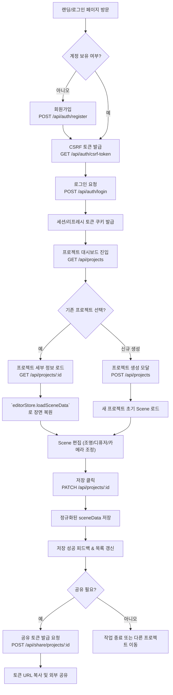
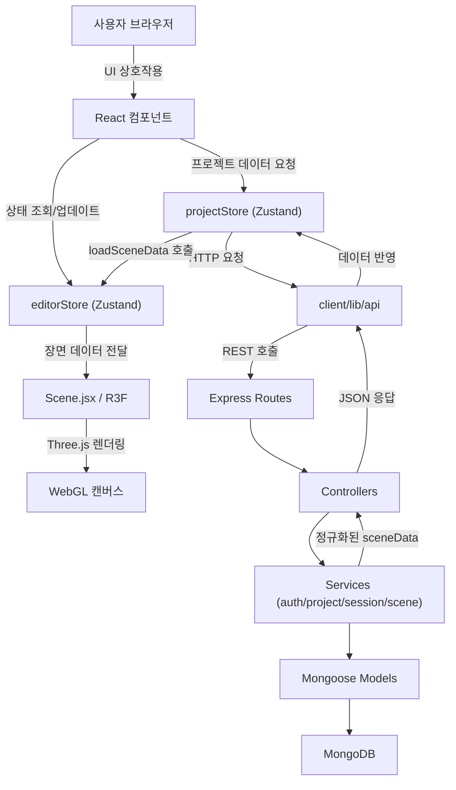
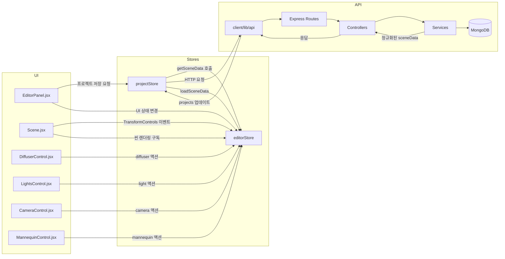

# LumoStage: 3D 조명 시뮬레이션 웹 앱 (MVP) - 제품 요구사항 문서

**문서 버전:** 1.3
**최종 수정일:** 2025년 10월 27일
**프로젝트 오너:** 김재준

## 1. 개요 (Overview)

### 1.1. 프로젝트명: LumoStage

### 1.2. 비전

영상 및 영화 제작자들이 실제 촬영에 들어가기 전, 웹 브라우저에서 간편하게 조명과 카메라 구도를 시뮬레이션하여 시간과 비용을 절약하고 창의적인 결과물을 만들 수 있도록 돕는 3D 시뮬레이션 툴.

### 1.3. 문제점

- 실제 촬영 현장에서 조명을 설치하고 테스트하는 데 많은 시간과 인력이 소모된다.
- 고가의 3D 소프트웨어는 사용법이 복잡하고 접근성이 낮아, 독립 영화 제작자나 학생, 유튜버들이 사용하기 어렵다.
- 팀원 간의 조명/카메라 구도에 대한 커뮤니케이션이 텍스트나 그림만으로는 명확하지 않다.

### 1.4. 해결 방안 (MVP)

MERN 스택과 Three.js (React-Three-Fiber)를 활용하여, 사용자가 웹에서 실시간으로 3D 공간에 오브젝트를 배치하고, 여러 개의 조명을 설치하며, 가상 카메라를 통해 결과물을 확인할 수 있는 핵심 기능에 집중한 웹 애플리케이션을 개발한다.

### 1.5. 타겟 사용자

- 영화/영상 전공 학생
- 독립 영화 제작자 및 감독
- 영상 콘텐츠 크리에이터 (유튜버 등)

## 2. 목표 (Goals)

### 2.1. 제품 목표

- 사용자는 3D 공간에서 기본적인 조명(Key, Fill, Back) 설정을 시뮬레이션할 수 있다.
- 사용자는 가상 카메라의 위치와 각도를 조절하여 원하는 샷을 미리 볼 수 있다.
- 모든 시뮬레이션 과정은 실시간으로 렌더링되어 즉각적인 피드백을 제공한다.

### 2.2. 기술 목표

- React와 React-Three-Fiber를 사용하여 인터랙티브한 3D UI/UX를 구현한다.
- Node.js/Express로 Scene(장면) 데이터를 저장하고 불러올 수 있는 안정적인 API를 구축한다.
- MongoDB를 사용하여 유연한 구조의 Scene 데이터를 관리한다.

## 3. 사용자 스토리 (User Stories)

- (연출가로서) 나는 3D 공간에 **마네킹 모델**을 배치하여, 조명이 피사체에 어떻게 영향을 미치는지 확인하고 싶다.
- (촬영감독으로서) 나는 여러 종류의 조명(점 조명, 스포트라이트, 주변광)을 추가하고, 각 조명의 위치, 색상, 강도를 조절하여 원하는 분위기를 만들고 싶다.
- (감독으로서) 나는 가상 카메라를 자유롭게 움직이고 렌즈 화각(FOV)을 조절하여, 다양한 앵글과 샷 사이즈를 테스트하고 싶다.
- (사용자로서) 나는 내가 작업한 조명 및 카메라 설정을 'Scene'으로 저장하고, 나중에 다시 불러와서 수정하고 싶다.

### 3.1. 사용자 여정 플로우



## 4. MVP 기능 명세 (MVP Feature Specifications)

### 4.1. 3D 뷰포트 (Viewport)

- Three.js 기반의 3D 캔버스가 화면의 중심을 차지한다.
- `@react-three/drei`의 `OrbitControls`를 통해 마우스로 화면 제어(궤도 회전, 확대/축소, 이동)가 가능하다.
- 기본적인 3D 환경: 바닥(Plane)과 중심에 **나무 마네킹(Wooden Mannequine) GLTF 모델**이 존재한다.

### 4.2. 조명 제어 (Light Controls)

**UI:** 화면 우측에 위치한 컨트롤 패널 (`EditorPanel.jsx`).
**상태 관리:** `Zustand`를 사용한 중앙 집중식 상태 관리 (`store.js`).

**기능:**

- **조명 추가:** `LightCard` 리스트에서 조명 유형(point, spot, directional, rect)에 따라 프리셋을 생성한다.
- **조명 목록:** 현재 Scene에 추가된 조명들이 카드 형태로 표시되며, 선택된 조명은 TransformControls와 연동된다.
- **조명 삭제:** 각 조명 카드에서 '삭제' 버튼으로 Scene의 조명을 제거할 수 있다.
- **속성 제어:** 선택된 조명의 속성(위치, 색상, 강도, 각도/펜움브라, 타깃 위치 등)을 슬라이더와 컬러 피커로 실시간 제어한다. 모든 변경사항은 `editorStore`를 통해 3D Scene에 즉시 반영된다.
- **레이어링:** 레터박스 오버레이(`LetterboxOverlay.jsx`)를 통해 카메라 비율 변경 시 프레임 가이드를 제공한다.

### 4.3. 디퓨저 시스템 (Diffuser System)

**UI:** `DiffuserControl.jsx` 섹션.
**상태 관리:** `editorStore`의 `diffusers` 슬라이스.

**기능:**

- **디퓨저 생성/삭제:** `addDiffuser`/`deleteDiffuser` 액션을 통해 독립적인 디퓨저 객체를 생성‧제거한다. 각 객체는 `nanoid()` 기반 고유 ID를 갖는다.
- **속성 제어:** 위치, 회전, 스케일, 투과율, 두께, 러프니스, 2차 광원 강도 등을 조절하며, 모든 변경은 Three.js `Mesh`에 즉시 반영된다.
- **조명 연동:** 특정 조명 ID 배열(`linkedLightIds`)을 통해 디퓨저가 필터링할 빛을 선택하고, 원본 광원 차단 여부(`blockOriginalLight`)를 토글할 수 있다.
- **장면 반영:** Scene 내 `Diffuser.jsx` 컴포넌트가 `R3F` 머티리얼 파라미터를 업데이트하여 실제 광량 변화가 시각화된다.

### 4.4. 카메라 제어 (Camera Controls)

**UI:** 컨트롤 패널 내 별도 섹션.
**상태 관리:** **`Zustand`** Store에서 카메라 상태 관리.

**기능:**

- **카메라 위치 (Position):** X, Y, Z 축 슬라이더로 카메라의 위치를 조정한다.
- **화각 (Field of View) 및 초점거리:** 슬라이더를 통해 렌즈의 화각을 조절하고, `cameraState.focalLength`로 시네마틱 대응값을 유지한다.
- **뷰 모드 전환:** Free/Camera 뷰 모드를 전환하여 OrbitControls와 카메라 프레임 사이를 전환한다.

### 4.5. 프로젝트 기반 Scene 저장 및 불러오기

**UI:** 컨트롤 패널 상단에 '저장' 버튼.

**기능:**

- **저장:** `editorStore.getSceneData()`가 반환하는 장면 정보를 `projectStore.updateProject()`를 통해 `PATCH /api/projects/:id`로 전송한다. 서버는 정규화된 `sceneData`를 저장하고 최신 프로젝트 정보를 반환한다.
- **불러오기:** 프로젝트 상세 진입 시 `GET /api/projects/:id` 응답의 `sceneData`를 `editorStore.loadSceneData()`가 파싱하여 `lights`, `diffusers`, `mannequins`, `cameraState`, `aspectRatio`를 초기화한다.
- **락 방지:** 각 프로젝트는 고유한 `diffusers` 배열을 보유하며, 서버 정규화 로직이 프로젝트 간 상태 공유를 차단한다.

## 5. 기술 스택 및 아키텍처 (Tech Stack & Architecture)

### 5.1. 기술 스택

- **Frontend**: React, Vite, Zustand
- **3D**: Three.js, React-Three-Fiber, React-Three-Drei
- **Styling**: Tailwind CSS
- **Backend**: Node.js, Express
- **Database**: MongoDB (Mongoose ODM 사용)

### 5.2. 아키텍처 및 컴포넌트 흐름

LumoStage는 클라이언트-서버 구조 위에 Three.js 렌더링 계층을 올린 형태다. 프론트엔드는 Zustand 스토어를 단일 진실 소스로 사용하며, 서버는 MVCS 패턴으로 프로젝트 단위 데이터를 정규화한다.

```
App.jsx
└─ Layout/AppLayout
   └─ EditorPage (client/src/pages)
      ├─ Scene.jsx ── subscribes editorStore
      │   ├─ Mannequin.jsx
      │   ├─ Diffuser.jsx (동적 N개)
      │   └─ Three.js Light meshes
      └─ EditorPanel.jsx ── mutates editorStore/projectStore
          ├─ LightsControl.jsx
          │   └─ LightCard.jsx (목록)
          ├─ DiffuserControl.jsx
          ├─ CameraControl.jsx
          └─ MannequinControl.jsx
```

- `editorStore` (`client/src/store/editorStore.js`): 장면 상태(`lights`, `diffusers`, `mannequins`, `cameraState`, `aspectRatio`)와 편집 UI 상태(`selectedLight`, `selectedDiffuser`)를 관리한다.
- `projectStore` (`client/src/store/projectStore.js`): 프로젝트 목록 및 단일 프로젝트 CRUD를 담당하고, `editorStore`와 연동해 저장/로드를 트리거한다.
- 서버 계층은 `routes → controllers → services → models` 순으로 요청을 처리하며, `scene.service.js`가 `sceneData` 정규화를 책임진다.

#### 시스템 플로우차트



#### 컴포넌트·스토어·이벤트 흐름



### 5.3. 데이터 스키마

| 필드            | 타입            | 설명                                                        |
| --------------- | --------------- | ----------------------------------------------------------- |
| `schemaVersion` | `number`        | Scene 데이터 포맷 버전 (기본값 `2`)                         |
| `aspectRatio`   | `string`        | 뷰포트 종횡비 (`16:9`, `4:3` 등)                            |
| `mannequins`    | `Array<Object>` | 마네킹 ID, 위치, 포즈 정보를 포함하는 배열                  |
| `lights`        | `Array<Object>` | 조명 타입(point/spot/directional/rect)과 속성 값            |
| `diffusers`     | `Array<Object>` | 디퓨저 ID, 위치/회전/스케일, 광학 속성, 연결된 조명 ID 목록 |
| `cameraState`   | `Object`        | 카메라 `position`, `target`, `focalLength` 등               |

```json
{
  "schemaVersion": 2,
  "aspectRatio": "16:9",
  "mannequins": [
    {
      "id": "man-123",
      "position": [0, -1.5, 0],
      "pose": { "waist_00": { "x": 0, "y": 0, "z": 0 } }
    }
  ],
  "lights": [
    {
      "id": "light-abc",
      "type": "spot",
      "position": [5, 7, 5],
      "color": "#ffffff",
      "intensity": 15,
      "targetPosition": [0, 1, 0]
    }
  ],
  "diffusers": [
    {
      "id": "diffuser-xyz",
      "position": [0, 2, 2],
      "rotation": [0, 0, 0],
      "scale": [2, 2, 1],
      "diffuseColor": "#ffffff",
      "opacity": 0.5,
      "transmission": 0.9,
      "thickness": 0.5,
      "roughness": 0.8,
      "useShader": true,
      "enableSecondaryLight": true,
      "secondaryLightIntensity": 5,
      "linkedLightIds": ["light-abc"],
      "blockOriginalLight": false
    }
  ],
  "cameraState": {
    "position": [0, 2, 8],
    "target": [0, 2, 0],
    "focalLength": 50
  }
}
```

### 5.4. API 구조

| 메서드   | 경로                      | 설명                               | 요청 본문 주요 필드                                 | 응답                      |
| -------- | ------------------------- | ---------------------------------- | --------------------------------------------------- | ------------------------- |
| `POST`   | `/api/auth/register`      | 이메일/패스워드 기반 회원 가입     | `username`, `email`, `password`                     | 사용자 정보 + 세션 쿠키   |
| `GET`    | `/api/projects`           | 로그인 사용자의 프로젝트 목록 조회 | -                                                   | `{ projects: Project[] }` |
| `POST`   | `/api/projects`           | 프로젝트 생성                      | `name`, `description?`, `sceneData`, `thumbnail?`   | `{ project }`             |
| `GET`    | `/api/projects/:id`       | 단일 프로젝트 상세 조회            | -                                                   | `{ project }`             |
| `PATCH`  | `/api/projects/:id`       | 프로젝트 업데이트 (씬 저장 포함)   | `name?`, `description?`, `sceneData?`, `thumbnail?` | `{ message, project }`    |
| `DELETE` | `/api/projects/:id`       | 프로젝트 삭제                      | -                                                   | 상태 코드 `204`           |
| `POST`   | `/api/share/projects/:id` | 공유 토큰 발급                     | -                                                   | `{ shareToken }`          |
| `DELETE` | `/api/share/projects/:id` | 공유 토큰 회수                     | -                                                   | 상태 코드 `204`           |
| `GET`    | `/api/share/:token`       | 공개 뷰어용 프로젝트 조회          | -                                                   | `{ project }`             |

`scene.service.normalizeSceneData()`가 모든 프로젝트 엔드포인트에서 호출되어 `diffusers`를 포함한 장면 정보를 정규화하고, 프로젝트 간 상태 오염을 방지한다.

## 6. 개발 로드맵 (Development Roadmap)

### ✅ Phase 1: 3D Scene 기본 환경 구축 (Frontend Only) - 완료

- **결과**: Vite+React 프로젝트 설정, R3F/Drei 라이브러리 연동 완료. `OrbitControls`가 적용된 기본 3D 캔버스에 바닥과 구(Sphere)를 렌더링함.

### ✅ Phase 2: 핵심 기능 UI 및 로직 구현 (Frontend Only) - 완료

- **결과**: Tailwind CSS 기반의 `EditorPanel` UI 구현. `Zustand`를 도입하여 조명과 카메라의 상태를 전역으로 관리. UI 컨트롤(슬라이더, 컬러 피커)과 3D Scene이 `Zustand`를 통해 실시간으로 연동됨. 기본 객체를 마네킹 모델로 교체.

### ➡️ Phase 3: 백엔드 연동 (MERN Full-stack) - 진행 중

- **목표**: Scene 저장 및 불러오기 기능 구현 및 프로젝트 단위 협업 준비.
- **세부 계획**:
  1. Node.js/Express 기반의 MVCS 패턴으로 `Project` 리소스 API 안정화 ✅
  2. `scene.service.normalizeSceneData()`로 `diffusers`/`lights`/`mannequins` 정규화 ✅
  3. 프론트엔드 `projectStore`와 `editorStore` 간 Scene 저장/로드 파이프라인 확장 ✅
  4. 공유 토큰 기반 공개 뷰어 제공 (`/api/share/:token`) ✅
  5. 향후 작업: 프로젝트 히스토리/버전 관리, 멀티 사용자 편집 (미착수)

### Phase 4: 배포 및 테스트

- **목표**: 개발된 애플리케이션을 웹에 배포하여 누구나 접근할 수 있도록 함.
- **세부 계획**:
  - Frontend 코드를 Vercel 또는 Netlify에 배포.
  - Backend 코드를 Heroku 또는 Fly.io와 같은 PaaS에 배포.
  - CORS(Cross-Origin Resource Sharing) 문제 해결 및 전체 기능 E2E 테스트.

## 7. 성공 지표 (Success Metrics)

- **작업 완료율:** 사용자가 웹사이트에 방문하여 Scene을 성공적으로 저장하는 비율.
- **성능:** 3개 이상의 조명이 설치된 환경에서도 초당 30프레임 이상을 유지하는가.
- **사용자 피드백:** 타겟 사용자들이 "쉽다", "직관적이다", "유용하다"와 같은 긍정적인 피드백을 남기는가.
- **데이터 안정성:** 서로 다른 프로젝트 간에 조명/디퓨저 상태가 오염되지 않고 독립적으로 유지되는가 (회귀 테스트 포함).
