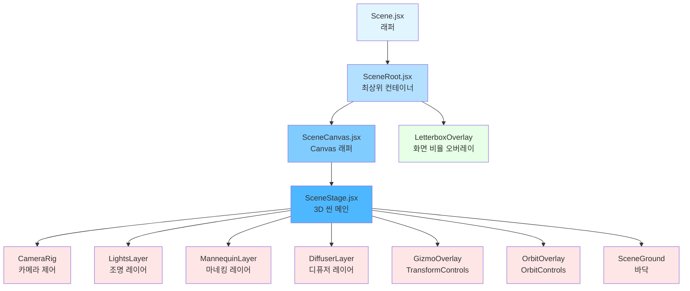
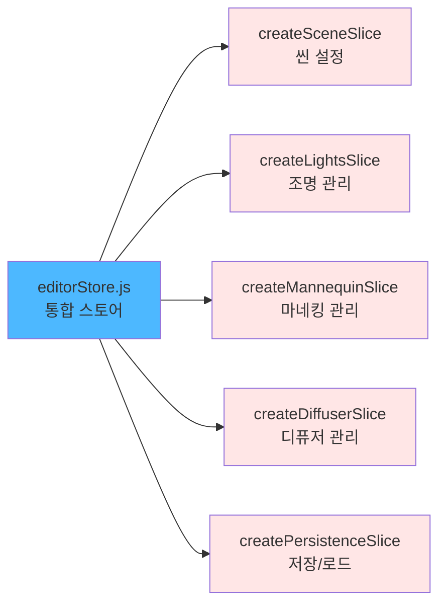
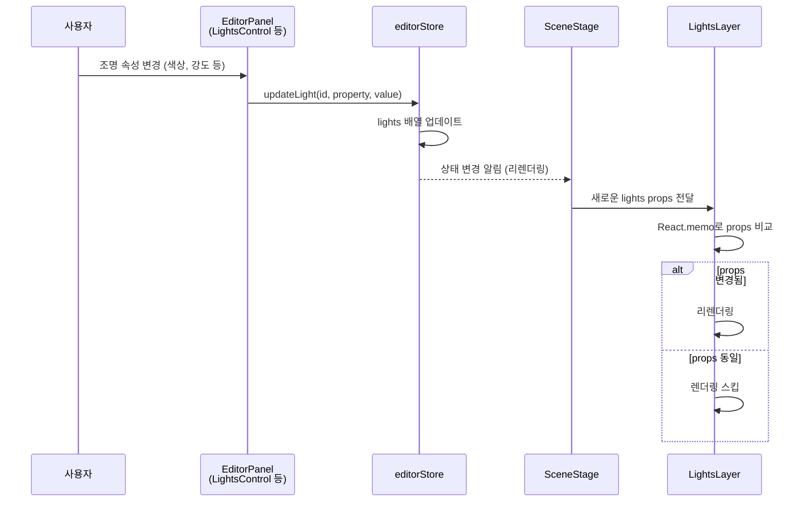
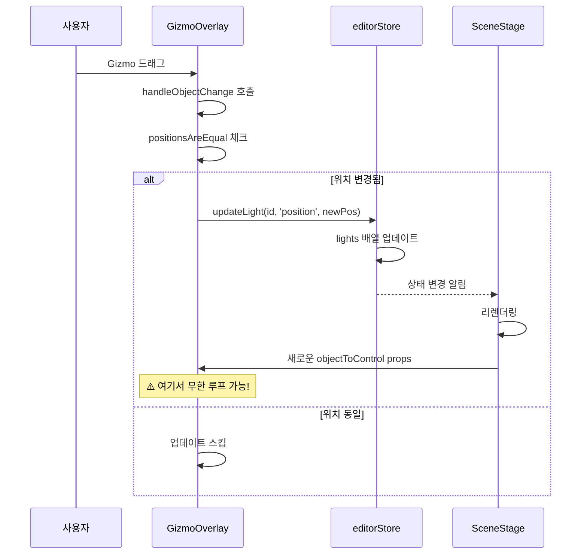

# Scene 모듈 분리 아키텍처 (C1)

> 작성일: 2025-10-29
> 목적: Scene 컴포넌트 분리 현황 파악 및 Infinite Render 문제 해결

## 1. 컴포넌트 계층 구조

### 전체 구조 Flowchart

### 주요 컴포넌트 역할

#### **SceneRoot.jsx** (최상위 컨테이너)
- **책임**: 레이아웃, ResizeObserver, Letterbox 계산
- **상태 구독**: `aspectRatio`, `viewMode`, `isTransformInteracting` (shallow)
- **특징**: DOM 관련 로직만 처리, 3D 로직은 하위 컴포넌트에 위임

#### **SceneCanvas.jsx** (Canvas 래퍼)
- **책임**: React-Three-Fiber Canvas 초기화
- **특징**: props만 전달, 상태 구독 없음 (성능 최적화)

#### **SceneStage.jsx** (3D 씬 메인)
- **책임**: 모든 3D 레이어 조합, 상태 관리, ref 관리
- **상태 구독**:
  - `lights`, `selectedLight`
  - `mannequins`, `selectedMannequinId`
  - `diffusers`, `selectedDiffuser`
  - `cameraState`, `viewMode`, `aspectRatio`
  - `transformMode`
- **문제점**: ⚠️ 너무 많은 개별 상태 구독 → 리렌더링 빈도 높음
- **개선 필요**: selector 통합 또는 shallow 사용

#### **LightsLayer.jsx** (조명 레이어)
- **책임**: 조명 렌더링 (Point, Spot, Directional)
- **특징**: `React.memo`로 최적화됨
- **props**: `lights`, `blockedLightIds`, `lightTargetObjectsRef`, `registerLightHandle`, `onLightPointerDown`

#### **MannequinLayer.jsx** (마네킹 레이어)
- **책임**: 마네킹 3D 모델 렌더링
- **특징**: `React.memo` + `Suspense`로 지연 로딩
- **props**: `mannequins`, `registerMannequinHandle`

#### **DiffuserLayer.jsx** (디퓨저 레이어)
- **책임**: 디퓨저 렌더링
- **props**: `diffusers`, `registerDiffuserHandle`, `onDiffuserPointerDown`

#### **GizmoOverlay.jsx** (TransformControls)
- **책임**: 선택된 객체의 Transform 조작
- **핵심 로직**: `handleObjectChange` - 위치 변경 감지 및 상태 업데이트
- **최적화**: `positionsAreEqual`로 중복 업데이트 방지
- **문제점**: ⚠️ `updateLight`, `setDiffuserPosition`, `setMannequinPosition`이 의존성 배열에 포함

#### **OrbitOverlay.jsx** (OrbitControls)
- **책임**: Free 모드에서 카메라 회전/이동 제어
- **특징**: `viewMode`에 따라 동적 활성화/비활성화

---

## 2. Store Slice 구조

### editorStore 통합 구조

### 각 Slice의 상태 및 액션

#### **createSceneSlice.js** (씬 설정)
**상태:**
- `cameraState`: { position, target, focalLength }
- `aspectRatio`: "16:9" | "4:3" | "1:1" 등
- `viewMode`: "free" | "camera"
- `transformMode`: "translate" | "rotate" | "scale"
- `isTransformInteracting`: boolean

**액션:**
- `setViewMode(mode)`
- `setTransformMode(mode)`
- `setAspectRatio(ratio)`
- `setIsTransformInteracting(value)`
- `updateCameraState(property, value)`

#### **createLightsSlice.js** (조명 관리)
**상태:**
- `lights`: 조명 배열
- `selectedLight`: 선택된 조명 ID

**액션:**
- `setSelectedLight(id)`
- `addLight(type)`
- `deleteLight(id)`
- `updateLight(id, property, value)`

#### **createMannequinSlice.js** (마네킹 관리)
**상태:**
- `mannequins`: 마네킹 배열
- `selectedMannequinId`: 선택된 마네킹 ID
- `highlightedBone`: 하이라이트된 뼈 이름

**액션:**
- `addMannequin()`
- `selectMannequin(id)`
- `deleteMannequin(id)`
- `setMannequinPosition(id, position)`
- `setHighlightedBone(boneName)`
- 등등...

#### **createDiffuserSlice.js** (디퓨저 관리)
**상태:**
- `diffusers`: 디퓨저 배열
- `selectedDiffuser`: 선택된 디퓨저 ID

**액션:**
- `addDiffuser()`
- `deleteDiffuser(id)`
- `setDiffuserPosition(id, position)`
- 등등...

#### **createPersistenceSlice.js** (저장/로드)
**액션:**
- `serializeState()`: 현재 상태를 직렬화
- `loadState(sceneData)`: 저장된 상태 복원

---

## 3. 데이터 흐름

### 사용자 → UI → Store → Scene 흐름

### TransformControls → Store 흐름 (Gizmo 드래그)

---

## 4. Infinite Render 문제 분석

### 🔴 문제 1: SceneStage의 과다한 상태 구독

**현재 상황:**

SceneStage.jsx에서 개별 상태를 여러 번 구독하고 있습니다:

- `transformMode` → 1개 구독
- `lights` → 1개 구독
- `selectedLight` → 1개 구독
- `diffusers` → 1개 구독
- `selectedDiffuser` → 1개 구독
- ... 총 10개 이상

**문제점:**

- 각 상태 변경마다 SceneStage가 리렌더링됨
- SceneStage가 리렌더링되면 모든 하위 레이어도 리렌더링 가능성
- `React.memo`가 있어도 props가 변경되면 리렌더링됨

**해결 방안 1: Selector 통합**

필요한 상태만 묶어서 한 번에 구독하고 `shallow` 사용:

- 위치: `client/src/components/editor/scene/SceneStage.jsx`
- 방법: 여러 개별 `useEditorStore` 호출을 하나의 selector로 통합

**해결 방안 2: useMemo로 파생 상태 캐싱**

`blockedLightIds`, `objectToControl` 등은 `useMemo`를 사용하고 있지만, 의존성 배열을 최소화해야 합니다.

---

### 🔴 문제 2: GizmoOverlay의 액션 함수 재생성

**현재 상황:**

GizmoOverlay의 `handleObjectChange`가 다음 함수들을 의존성으로 가지고 있습니다:
- `updateLight`
- `setDiffuserPosition`
- `setMannequinPosition`

**문제점:**

이 함수들이 매번 재생성되면 `handleObjectChange`도 재생성되고, `useCallback`의 효과가 사라집니다.

**해결 방안: useEditorStore.getState() 직접 사용**

의존성 배열에서 액션 함수를 제거하고, 내부에서 `useEditorStore.getState()`를 사용하여 직접 호출합니다.

현재 코드를 보니 이미 `useEditorStore.getState()`를 사용하고 있지만, 여전히 의존성 배열에 액션 함수들이 포함되어 있습니다.

**개선 포인트:**
- 의존성 배열을 `[]`로 변경
- 모든 액션 호출을 `useEditorStore.getState()`를 통해 실행

---

### 🔴 문제 3: lightTargetObjectsRef의 불안정한 참조

**현재 상황:**

LightsLayer에서 `lightTargetObjectsRef.current.set(light.id, new THREE.Object3D())`를 매 렌더링마다 실행하고 있습니다.

**문제점:**

- 조건문으로 체크하고 있지만, lights 배열이 변경될 때마다 모든 조명에 대해 검사
- 새로운 Object3D 생성 자체는 문제없지만, primitive object의 참조 변경이 리렌더링 유발 가능

**해결 방안:**

`useMemo`로 targetObjects Map을 생성하고, lights 배열의 id가 변경될 때만 재생성합니다.

---

### 🔴 문제 4: useEffect의 불안정한 의존성

**현재 상황:**

SceneStage의 여러 `useEffect`가 복잡한 의존성을 가지고 있습니다:

- TransformControls attach/detach
- OrbitControls enable/disable
- 등등...

**문제점:**

- `objectToControl`이 매번 새로 계산되면 `useEffect`가 반복 실행
- `viewMode`, `selectedLight`, `selectedDiffuser` 등이 변경될 때마다 효과 재실행

**해결 방안:**

- `objectToControl`을 `useMemo`로 안정화 (이미 되어 있음)
- `useEffect` 내부에서 ref를 사용하여 최신 값 참조
- 불필요한 의존성 제거

---

## 5. 해결 체크리스트

### 🎯 즉시 적용 가능한 개선사항

- [ ] **SceneStage 상태 구독 통합**: 10개 이상의 개별 구독 → 3-4개의 selector로 통합 + `shallow`
  - 파일: `client/src/components/editor/scene/SceneStage.jsx`

- [ ] **GizmoOverlay 의존성 배열 정리**: 액션 함수를 의존성에서 제거
  - 파일: `client/src/components/editor/scene/GizmoOverlay.jsx`

- [ ] **LightsLayer targetObjects 안정화**: `useMemo`로 Map 생성
  - 파일: `client/src/components/editor/scene/LightsLayer.jsx`

- [ ] **registerHandle 함수들 메모이제이션 확인**: `useCallback`의 의존성 배열이 빈 배열인지 확인
  - 파일: `client/src/components/editor/scene/SceneStage.jsx`

### 🔍 디버깅 도구 추가

- [ ] **React DevTools Profiler** 사용하여 리렌더링 추적
- [ ] **useWhyDidYouUpdate** 커스텀 훅 추가로 리렌더링 원인 로깅
- [ ] **Console.log 추가**: 각 컴포넌트의 렌더링 시점 확인

### 📊 성능 측정

- [ ] **renderCount**: 각 레이어의 렌더링 횟수 카운팅
- [ ] **useFrame**: Three.js 프레임 레이트 모니터링
- [ ] **invalidate() 호출**: 필요한 경우에만 렌더링 트리거

---

## 6. 권장 리팩토링 순서

### Phase 1: 상태 구독 최적화 (높은 우선순위)

1. SceneStage의 상태 구독을 selector로 통합
2. `shallow` 비교 적용
3. 불필요한 상태 구독 제거

### Phase 2: GizmoOverlay 안정화 (높은 우선순위)

1. 의존성 배열에서 액션 함수 제거
2. `positionsAreEqual` 로직 강화
3. 디바운스 또는 throttle 적용 검토

### Phase 3: Layer 컴포넌트 최적화 (중간 우선순위)

1. LightsLayer의 targetObjects 안정화
2. MannequinLayer의 props 구조 단순화
3. DiffuserLayer 최적화

### Phase 4: useEffect 정리 (낮은 우선순위)

1. 불필요한 의존성 제거
2. ref 기반 로직으로 전환
3. cleanup 함수 점검

---

## 7. 참고 자료

### Zustand 최적화 패턴

- [Zustand Best Practices](https://github.com/pmndrs/zustand#selecting-multiple-state-slices)
- Selector + `shallow` 사용 예시
- Slice 패턴

### React-Three-Fiber 최적화

- [R3F Performance](https://docs.pmnd.rs/react-three-fiber/advanced/pitfalls)
- `invalidate()` 사용법
- `useFrame` 최적화

### React Memo & Callback

- [React.memo](https://react.dev/reference/react/memo)
- [useCallback](https://react.dev/reference/react/useCallback)
- [useMemo](https://react.dev/reference/react/useMemo)

---

## 8. 다음 단계

1. ✅ 이 문서를 기반으로 문제 원인 파악 완료
2. ⏳ 위 체크리스트에 따라 순차적으로 개선 작업 진행
3. ⏳ 각 개선 후 렌더링 성능 측정 및 기록
4. ⏳ 완료 후 `docs/development/frontend-refactor-plan-2025-10-26.md` 업데이트

---

*이 문서는 C1 작업의 현재 상태를 분석하고, infinite render 문제의 해결 방안을 제시합니다.*
